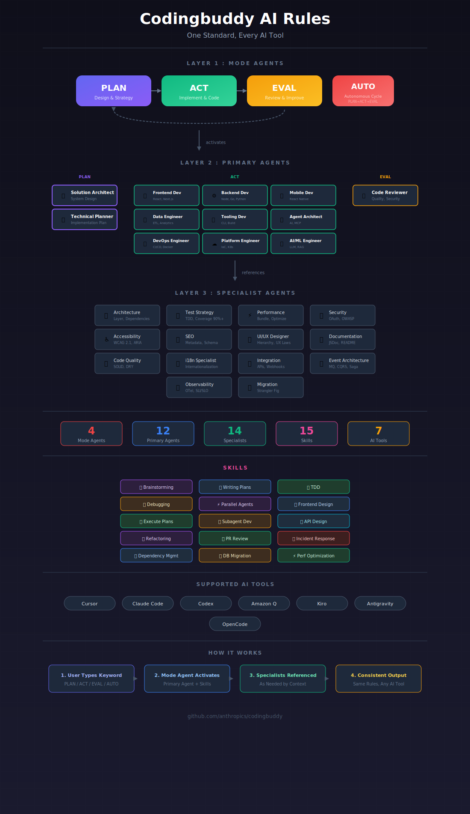

<p align="center">
  <a href="README.md">English</a> |
  <a href="README.ko.md">한국어</a> |
  <a href="README.zh-CN.md">中文</a> |
  <a href="README.ja.md">日本語</a> |
  <a href="README.es.md">Español</a>
</p>

# Codingbuddy

[](https://github.com/JeremyDev87/codingbuddy/actions/workflows/dev.yml)
[](https://www.npmjs.com/package/codingbuddy)
[](https://opensource.org/licenses/MIT)

<p align="center">
  
</p>

## 为您的代码打造 AI 专家团队

**Codingbuddy 协调 29 个专业 AI 智能体，提供人类专家团队级别的代码质量。**

单一 AI 无法成为所有领域的专家。Codingbuddy 创建了一个由架构师、开发者、安全专家、无障碍专家等组成的 AI 开发团队，他们协作审查、验证和优化您的代码，直到达到专业标准。

---

## 愿景

### 问题

当您要求 AI 编写代码时，您只能获得单一视角。没有安全审查，没有无障碍检查，没有架构验证。只是一个 AI 把所有事情做得"还行"，但没有一件做得出色。

人类开发团队有专家：
- 设计系统的**架构师**
- 发现漏洞的**安全工程师**
- 捕获边缘情况的 **QA 专家**
- 优化瓶颈的**性能专家**

### 我们的解决方案

**Codingbuddy 将专家团队模式引入 AI 编程。**

Codingbuddy 不是让一个 AI 尝试做所有事情，而是协调多个专业智能体协作：

```
┌─────────────────────────────────────────────────────────────┐
│                        您的请求                              │
│                  "实现用户认证"                               │
└─────────────────────────────────────────────────────────────┘
                            │
                            ▼
┌─────────────────────────────────────────────────────────────┐
│ 📋 PLAN: 解决方案架构师 + 架构专家                            │
│          → 设计系统架构                                       │
│          → 定义安全需求                                       │
└─────────────────────────────────────────────────────────────┘
                            │
                            ▼
┌─────────────────────────────────────────────────────────────┐
│ 🚀 ACT: 后端开发者 + 测试策略专家                             │
│         → 使用 TDD 实现                                      │
│         → 遵循质量标准                                        │
└─────────────────────────────────────────────────────────────┘
                            │
                            ▼
┌─────────────────────────────────────────────────────────────┐
│ 🔍 EVAL: 代码审查员 + 并行专家                                │
│          🔒 安全      → JWT 漏洞？                            │
│          ♿ 无障碍    → WCAG 合规？                           │
│          ⚡ 性能      → 需要优化？                            │
│          📏 质量      → SOLID 原则？                          │
└─────────────────────────────────────────────────────────────┘
                            │
              ┌─────────────┴─────────────┐
              │                           │
        Critical > 0?              Critical = 0 AND
        High > 0?                  High = 0
              │                           │
              ▼                           ▼
        带着改进返回                 ✅ 质量达成
        PLAN 阶段                  自信地部署
```

---

## 多智能体架构

### 三层智能体系统

| 层级 | 智能体 | 角色 |
|------|--------|------|
| **模式智能体** | plan-mode, act-mode, eval-mode | 工作流编排 |
| **主要智能体** | solution-architect, frontend-developer, backend-developer, code-reviewer 等 8 个 | 核心实现 |
| **专家智能体** | security, accessibility, performance, test-strategy 等 15 个 | 领域专业知识 |

### 智能体协作示例

当您请求一个功能时，智能体会自动协作：

```
🤖 solution-architect    → 设计方法
   └── 👤 architecture-specialist  → 验证层边界
   └── 👤 test-strategy-specialist → 规划测试覆盖

🤖 backend-developer     → 实现代码
   └── 👤 security-specialist      → 审查认证模式
   └── 👤 event-architecture       → 设计消息流

🤖 code-reviewer         → 评估质量
   └── 👤 4 个专家并行           → 多维度审查
```

---

## 质量保证循环

### PLAN → ACT → EVAL 循环

Codingbuddy 实施质量驱动的开发循环：

1. **PLAN**: 编码前设计（架构、测试策略）
2. **ACT**: 使用 TDD 和质量标准实现
3. **EVAL**: 多专家审查（安全、性能、无障碍、质量）
4. **迭代**: 持续直到达到质量目标

### AUTO 模式：自主质量达成

```bash
# 只需描述您想要的
AUTO: 实现带刷新令牌的 JWT 认证

# Codingbuddy 自动：
# → 规划实现
# → 使用 TDD 编写代码
# → 4+ 专家审查
# → 迭代直到：Critical=0 AND High=0
# → 交付生产就绪代码
```

### 退出条件

| 严重级别 | 部署前必须修复 |
|----------|----------------|
| 🔴 Critical | 是 - 紧急安全/数据问题 |
| 🟠 High | 是 - 重要问题 |
| 🟡 Medium | 可选 - 技术债务 |
| 🟢 Low | 可选 - 改进 |

---

## 差异化优势

| 传统 AI 编程 | Codingbuddy |
|-------------|-------------|
| 单一 AI 视角 | 29 个专家智能体视角 |
| "生成然后祈祷" | 计划 → 实现 → 验证 |
| 无质量门禁 | Critical=0, High=0 必需 |
| 需要手动审查 | 自动多维度审查 |
| 质量不一致 | 迭代优化直到达标 |

---

## 快速开始

### 前置条件

- **Node.js** 18.x 或更高版本
- **npm** 9.x+ 或 **yarn** 4.x+
- 支持的 AI 工具（Claude Code, Cursor, GitHub Copilot 等）

### 安装

```bash
# 初始化您的项目
npx codingbuddy init

# 添加到 Claude Desktop 配置
# macOS: ~/Library/Application Support/Claude/claude_desktop_config.json
# Windows: %APPDATA%\Claude\claude_desktop_config.json
```

```json
{
  "mcpServers": {
    "codingbuddy": {
      "command": "npx",
      "args": ["codingbuddy", "mcp"]
    }
  }
}
```

### 开始使用

```
PLAN: 实现带邮箱验证的用户注册
→ AI 团队规划架构

ACT
→ AI 团队使用 TDD 实现

EVAL
→ AI 团队从 8+ 视角审查

AUTO: 构建完整的认证系统
→ AI 团队迭代直到质量达成
```

[完整入门指南 →](docs/zh-CN/getting-started.md)

### Claude Code 插件（可选）

增强与 Claude Code 的集成：

```bash
# 添加市场
claude marketplace add JeremyDev87/codingbuddy

# 安装插件
claude plugin install codingbuddy@jeremydev87

# 安装 MCP 服务器以获得完整功能
npm install -g codingbuddy
```

| 文档 | 描述 |
|------|------|
| [插件设置指南](docs/plugin-guide.md) | 安装和配置 |
| [快速参考](docs/plugin-quick-reference.md) | 命令和模式概览 |
| [架构](docs/plugin-architecture.md) | 插件和 MCP 如何协作 |

---

## 支持的 AI 工具

| 工具 | 状态 |
|------|------|
| Claude Code | ✅ 完整 MCP + 插件 |
| Cursor | ✅ 支持 |
| GitHub Copilot | ✅ 支持 |
| Antigravity | ✅ 支持 |
| Amazon Q | ✅ 支持 |
| Kiro | ✅ 支持 |
| OpenCode | ✅ 支持 |

[设置指南 →](docs/zh-CN/supported-tools.md)

---

## 文档

| 文档 | 描述 |
|------|------|
| [快速开始](docs/zh-CN/getting-started.md) | 安装和快速设置 |
| [设计理念](docs/zh-CN/philosophy.md) | 愿景和设计原则 |
| [智能体系统](packages/rules/.ai-rules/agents/README.md) | 完整智能体参考 |
| [支持的工具](docs/zh-CN/supported-tools.md) | AI 工具集成指南 |
| [配置](docs/config-schema.md) | 配置文件选项 |
| [API 参考](docs/api.md) | MCP 服务器功能 |

---

## 贡献

欢迎贡献！详情请参阅 [CONTRIBUTING.md](CONTRIBUTING.md)。

## 许可证

MIT © [Codingbuddy](https://github.com/JeremyDev87/codingbuddy)
