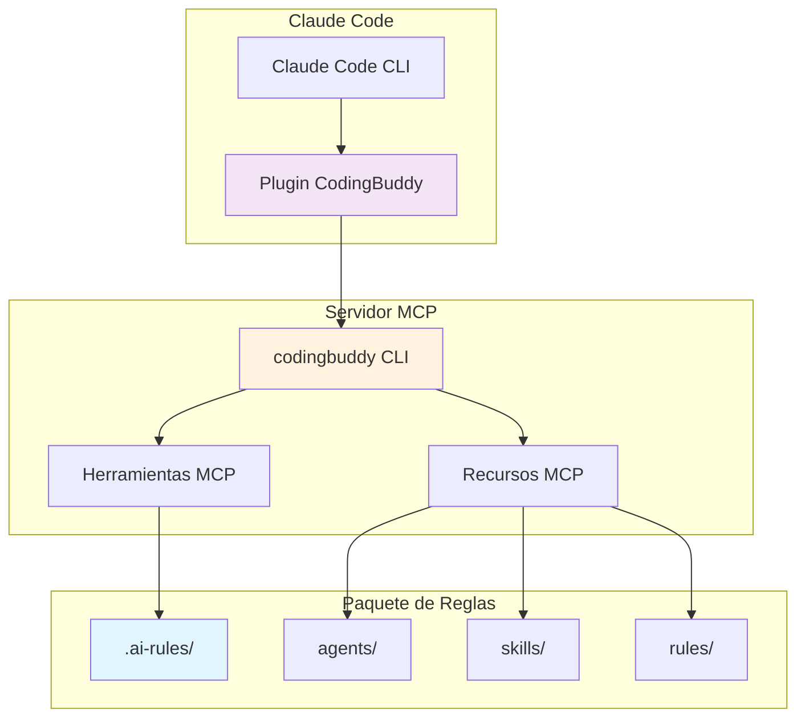
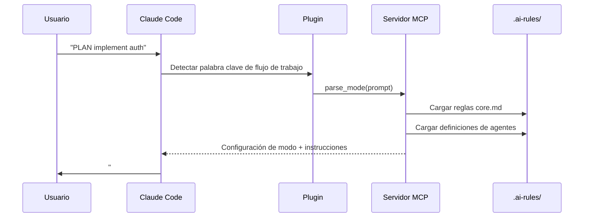
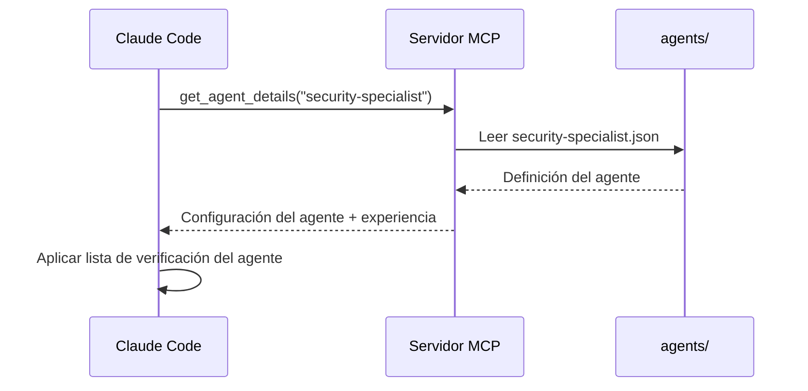
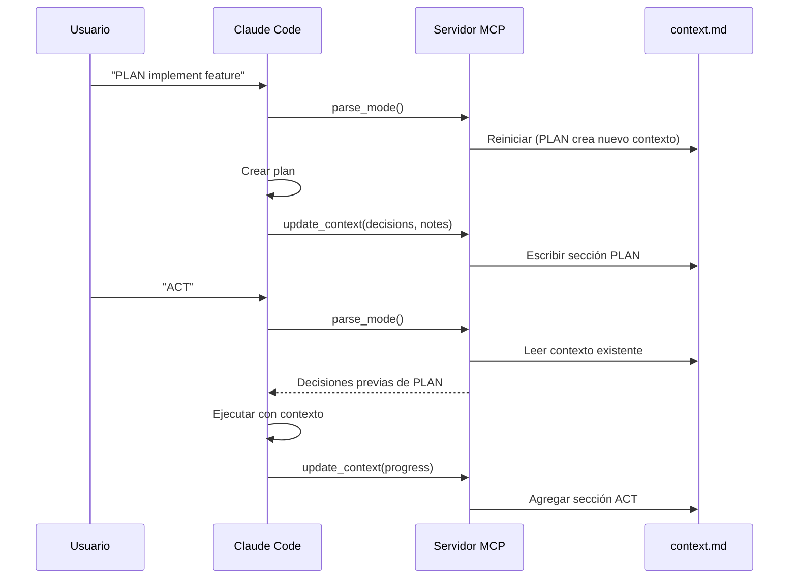

<p align="center">
  <a href="../plugin-architecture.md">English</a> |
  <a href="../ko/plugin-architecture.md">한국어</a> |
  <a href="../zh-CN/plugin-architecture.md">中文</a> |
  <a href="../ja/plugin-architecture.md">日本語</a> |
  <a href="plugin-architecture.md">Español</a> |
  <a href="../pt-BR/plugin-architecture.md">Português</a>
</p>

# Arquitectura del Plugin de CodingBuddy

Este documento explica cómo funciona el Plugin de CodingBuddy para Claude Code, sus componentes y cómo interactúan.

## Visión General

CodingBuddy utiliza una arquitectura de **plugin ligero** donde el Plugin de Claude Code sirve como un punto de entrada liviano, mientras que el servidor MCP proporciona la funcionalidad real.



## Capas de Arquitectura

### Capa 1: Plugin de Claude Code

**Ubicación**: `packages/claude-code-plugin/`

**Propósito**: Punto de entrada para la integración con Claude Code

**Componentes**:
| Archivo | Propósito |
|---------|-----------|
| `.claude-plugin/plugin.json` | Manifiesto del plugin (nombre, versión, descripción) |
| `.mcp.json` | Configuración del servidor MCP |
| `commands/*.md` | Documentación de comandos para Claude |
| `README.md` | Resumen del plugin |

**Información Clave**: El plugin es intencionalmente ligero. Contiene:
- **Sin lógica de negocio** - Toda la lógica reside en el servidor MCP
- **Sin definiciones de agentes** - Todos los agentes residen en `.ai-rules/`
- **Sin implementaciones de habilidades** - Todas las habilidades residen en `.ai-rules/`

### Capa 2: Servidor MCP

**Ubicación**: `apps/mcp-server/` (mediante el CLI `codingbuddy`)

**Propósito**: Proporciona herramientas y recursos mediante el Model Context Protocol

**Herramientas MCP**:
| Herramienta | Descripción |
|-------------|-------------|
| `parse_mode` | Analizar PLAN/ACT/EVAL/AUTO del prompt del usuario |
| `get_agent_details` | Obtener configuración del agente especialista |
| `prepare_parallel_agents` | Preparar agentes para ejecución paralela |
| `generate_checklist` | Generar listas de verificación específicas por dominio |
| `analyze_task` | Analizar tarea para recomendaciones |
| `read_context` | Leer documento de contexto de sesión |
| `update_context` | Actualizar contexto con progreso |
| `get_project_config` | Obtener configuración del proyecto |
| `recommend_skills` | Recomendar habilidades para una tarea |

**Recursos MCP**:
| Recurso | Patrón URI | Descripción |
|---------|------------|-------------|
| Agentes | `agent://{nombre}` | Definiciones de agentes especialistas |
| Habilidades | `skill://{nombre}` | Definiciones de flujos de trabajo reutilizables |
| Reglas | `rules://{nombre}` | Reglas centrales (core.md, project.md) |

### Capa 3: Paquete de Reglas

**Ubicación**: `packages/rules/.ai-rules/`

**Propósito**: Fuente única de verdad para todas las definiciones

**Estructura**:
```
.ai-rules/
├── agents/           # Definiciones de agentes especialistas (JSON)
│   ├── frontend-developer.json
│   ├── backend-developer.json
│   ├── security-specialist.json
│   └── ... (12+ agentes)
├── skills/           # Flujos de trabajo reutilizables (Markdown)
│   ├── tdd.md
│   ├── debugging.md
│   ├── api-design.md
│   └── ... (14+ habilidades)
├── rules/            # Reglas centrales
│   ├── core.md       # Modos PLAN/ACT/EVAL/AUTO
│   ├── project.md    # Configuración del proyecto, arquitectura
│   └── augmented-coding.md  # TDD, calidad del código
└── adapters/         # Guías específicas por herramienta
    ├── claude-code.md
    ├── cursor.md
    └── ...
```

## Flujo de Datos

### Activación del Modo de Flujo de Trabajo



### Activación de Agente Especialista



### Persistencia de Contexto



## Principios Clave de Diseño

### 1. Fuente Única de Verdad

Todas las definiciones de agentes, habilidades y reglas residen en `packages/rules/.ai-rules/`. Esto asegura:

- **Sin duplicación** - Las definiciones existen en exactamente un lugar
- **Consistencia** - Todas las herramientas (Cursor, Claude Code, etc.) usan las mismas definiciones
- **Mantenimiento fácil** - Actualice una vez, propague a todas partes

### 2. Plugin Ligero, Servidor Rico

El plugin contiene código mínimo:
- Manifiesto del plugin para descubrimiento de Claude Code
- Configuración MCP apuntando al servidor
- Documentación de comandos

Toda la lógica, agentes y habilidades son servidos por el servidor MCP.

### 3. Comunicación Basada en Protocolo

El plugin se comunica con el servidor MCP usando el Model Context Protocol:

```json
// Solicitud
{
  "jsonrpc": "2.0",
  "method": "tools/call",
  "params": {
    "name": "parse_mode",
    "arguments": { "prompt": "PLAN implement auth" }
  }
}

// Respuesta
{
  "jsonrpc": "2.0",
  "result": {
    "mode": "PLAN",
    "instructions": "...",
    "agent": "solution-architect"
  }
}
```

### 4. El Contexto Sobrevive a la Compactación

El contexto se persiste en `docs/codingbuddy/context.md`:
- Cuando la ventana de contexto de Claude se llena, los mensajes antiguos se resumen
- El documento de contexto preserva decisiones y notas críticas
- El modo ACT puede leer las decisiones de PLAN incluso después de la compactación

## Archivos de Configuración

### Manifiesto del Plugin (`plugin.json`)

```json
{
  "$schema": "https://anthropic.com/claude-code/plugin.schema.json",
  "name": "codingbuddy",
  "version": "2.4.1",
  "description": "Multi-AI Rules for consistent coding practices"
}
```

### Configuración MCP (`.mcp.json`)

```json
{
  "mcpServers": {
    "codingbuddy": {
      "command": "codingbuddy",
      "args": []
    }
  }
}
```

### Configuración del Proyecto (`codingbuddy.config.js`)

```javascript
module.exports = {
  language: 'es',
  defaultMode: 'PLAN',
  specialists: ['security-specialist', 'performance-specialist']
};
```

## Comportamiento de Respaldo

### Cuando el Servidor MCP No Está Disponible

Si el CLI `codingbuddy` no está instalado:

1. El plugin aún se carga en Claude Code
2. La documentación de comandos está disponible
3. Las herramientas MCP devuelven errores
4. Los modos de flujo de trabajo funcionan en modo degradado (sin persistencia de contexto)

### Configuración Recomendada

Para funcionalidad completa:
1. Agregar marketplace: `claude marketplace add https://jeremydev87.github.io/codingbuddy`
2. Instalar plugin: `claude plugin install codingbuddy@jeremydev87`
3. Instalar servidor MCP: `npm install -g codingbuddy`
4. Configurar MCP en la configuración de Claude

## Versionado

### Sincronización de Versiones

El plugin usa un script de construcción para sincronizar versiones:

```bash
# En packages/claude-code-plugin/
npm run sync-version
```

Esto asegura que la versión de `plugin.json` coincida con `package.json`.

### Matriz de Compatibilidad

| Versión del Plugin | Versión del Servidor MCP | Compatible |
|-------------------|--------------------------|------------|
| 3.0.x | 3.0.x | ✅ |
| 2.x | 2.x | ✅ |
| 3.x | 2.x | ⚠️ Parcial |

## Ver También

- [Guía de Instalación](./plugin-guide.md) - Instrucciones de configuración
- [Referencia Rápida](./plugin-quick-reference.md) - Comandos y modos
- [Ejemplos](./plugin-examples.md) - Flujos de trabajo del mundo real
- [Resolución de Problemas](./plugin-troubleshooting.md) - Problemas comunes

---

<sub>🤖 Este documento fue traducido con asistencia de IA. Si encuentras errores o sugerencias de mejora, por favor repórtalos en [GitHub Issues](https://github.com/JeremyDev87/codingbuddy/issues).</sub>
