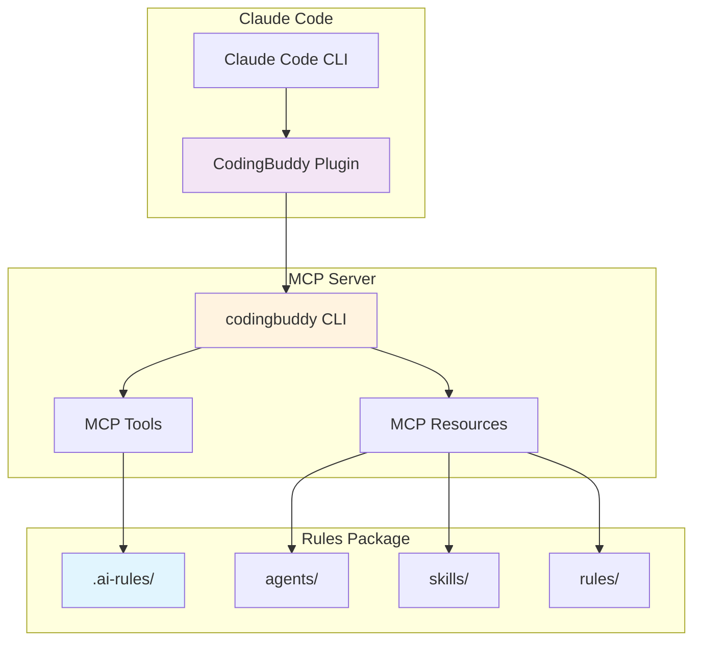
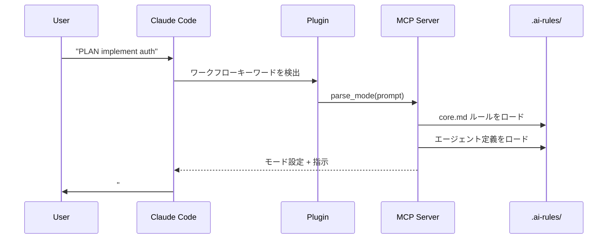
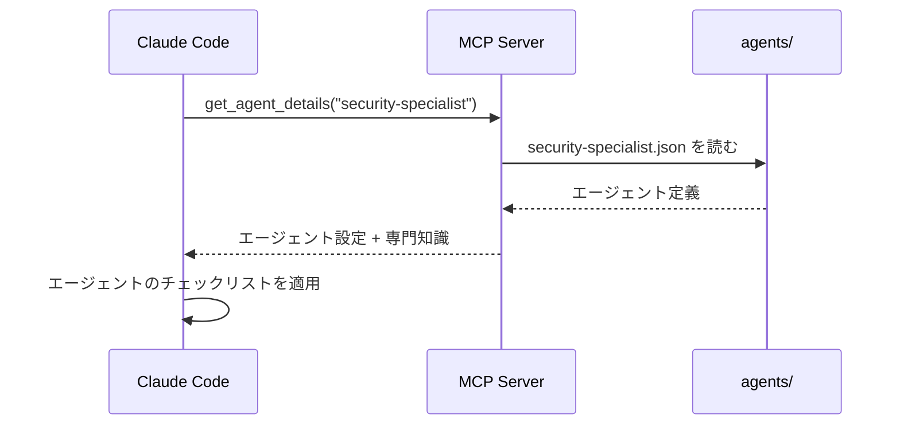
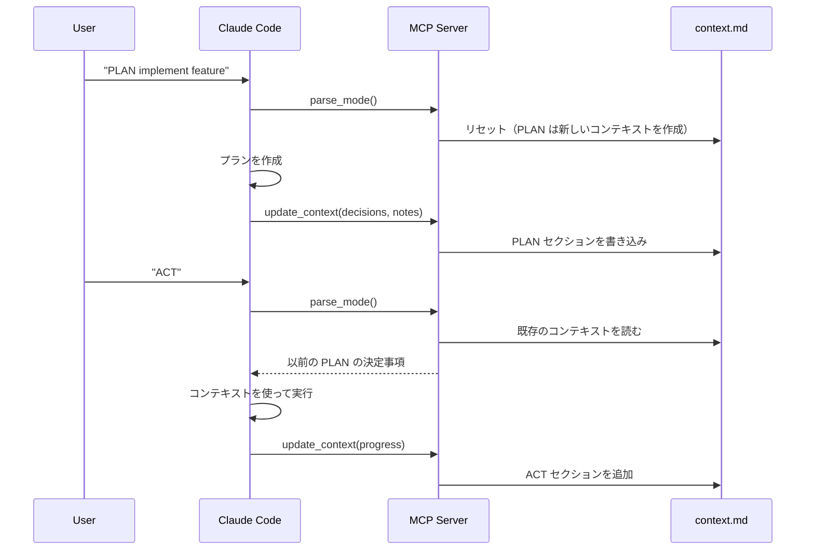

<p align="center">
  <a href="../plugin-architecture.md">English</a> |
  <a href="../ko/plugin-architecture.md">한국어</a> |
  <a href="../zh-CN/plugin-architecture.md">中文</a> |
  <a href="plugin-architecture.md">日本語</a> |
  <a href="../es/plugin-architecture.md">Español</a> |
  <a href="../pt-BR/plugin-architecture.md">Português</a>
</p>

# CodingBuddy プラグインアーキテクチャ

このドキュメントでは、CodingBuddy Claude Code プラグインの仕組み、コンポーネント、およびそれらの相互作用について説明します。

## 概要

CodingBuddy は **薄いプラグイン** アーキテクチャを採用しており、Claude Code プラグインは軽量なエントリーポイントとして機能し、MCP サーバーが実際の機能を提供します。



## アーキテクチャレイヤー

### レイヤー 1: Claude Code プラグイン

**場所**: `packages/claude-code-plugin/`

**目的**: Claude Code 統合のエントリーポイント

**コンポーネント**:
| ファイル | 目的 |
|------|---------|
| `.claude-plugin/plugin.json` | プラグインマニフェスト（名前、バージョン、説明） |
| `.mcp.json` | MCP サーバー設定 |
| `commands/*.md` | Claude 用コマンドドキュメント |
| `README.md` | プラグイン概要 |

**重要なポイント**: プラグインは意図的に薄く設計されています。含まれるのは：
- **ビジネスロジックなし** - すべてのロジックは MCP サーバーに存在
- **エージェント定義なし** - すべてのエージェントは `.ai-rules/` に存在
- **スキル実装なし** - すべてのスキルは `.ai-rules/` に存在

### レイヤー 2: MCP サーバー

**場所**: `apps/mcp-server/`（`codingbuddy` CLI 経由）

**目的**: Model Context Protocol 経由でツールとリソースを提供

**MCP ツール**:
| ツール | 説明 |
|------|-------------|
| `parse_mode` | ユーザープロンプトから PLAN/ACT/EVAL/AUTO を解析 |
| `get_agent_details` | スペシャリストエージェント設定を取得 |
| `prepare_parallel_agents` | 並列実行用のエージェントを準備 |
| `generate_checklist` | ドメイン固有のチェックリストを生成 |
| `analyze_task` | 推奨事項のためにタスクを分析 |
| `read_context` | セッションコンテキストドキュメントを読む |
| `update_context` | 進捗でコンテキストを更新 |
| `get_project_config` | プロジェクト設定を取得 |
| `recommend_skills` | タスクに対するスキルを推奨 |

**MCP リソース**:
| リソース | URI パターン | 説明 |
|----------|-------------|-------------|
| Agents | `agent://{name}` | スペシャリストエージェント定義 |
| Skills | `skill://{name}` | 再利用可能なワークフロー定義 |
| Rules | `rules://{name}` | コアルール（core.md、project.md） |

### レイヤー 3: ルールパッケージ

**場所**: `packages/rules/.ai-rules/`

**目的**: すべての定義の単一の真実の源

**構造**:
```
.ai-rules/
├── agents/           # スペシャリストエージェント定義（JSON）
│   ├── frontend-developer.json
│   ├── backend-developer.json
│   ├── security-specialist.json
│   └── ... (12+ エージェント)
├── skills/           # 再利用可能なワークフロー（Markdown）
│   ├── tdd.md
│   ├── debugging.md
│   ├── api-design.md
│   └── ... (14+ スキル)
├── rules/            # コアルール
│   ├── core.md       # PLAN/ACT/EVAL/AUTO モード
│   ├── project.md    # プロジェクトセットアップ、アーキテクチャ
│   └── augmented-coding.md  # TDD、コード品質
└── adapters/         # ツール固有のガイド
    ├── claude-code.md
    ├── cursor.md
    └── ...
```

## データフロー

### ワークフローモードの有効化



### スペシャリストエージェントの有効化



### コンテキストの永続化



## 主要な設計原則

### 1. 単一の真実の源

すべてのエージェント、スキル、ルール定義は `packages/rules/.ai-rules/` に存在します。これにより：

- **重複なし** - 定義は正確に 1 か所に存在
- **一貫性** - すべてのツール（Cursor、Claude Code など）が同じ定義を使用
- **メンテナンスが容易** - 1 か所で更新すれば、すべてに反映

### 2. 薄いプラグイン、リッチなサーバー

プラグインには最小限のコード：
- Claude Code 検出用のプラグインマニフェスト
- サーバーを指す MCP 設定
- コマンドドキュメント

すべてのロジック、エージェント、スキルは MCP サーバーから提供されます。

### 3. プロトコルベースの通信

プラグインは Model Context Protocol を使用して MCP サーバーと通信します：

```json
// リクエスト
{
  "jsonrpc": "2.0",
  "method": "tools/call",
  "params": {
    "name": "parse_mode",
    "arguments": { "prompt": "PLAN implement auth" }
  }
}

// レスポンス
{
  "jsonrpc": "2.0",
  "result": {
    "mode": "PLAN",
    "instructions": "...",
    "agent": "solution-architect"
  }
}
```

### 4. コンパクション後もコンテキストが維持される

コンテキストは `docs/codingbuddy/context.md` に永続化されます：
- Claude のコンテキストウィンドウがいっぱいになると、古いメッセージは要約される
- コンテキストドキュメントは重要な決定事項とメモを保持
- ACT モードはコンパクション後でも PLAN の決定事項を読むことができる

## 設定ファイル

### プラグインマニフェスト（`plugin.json`）

```json
{
  "$schema": "https://anthropic.com/claude-code/plugin.schema.json",
  "name": "codingbuddy",
  "version": "2.4.1",
  "description": "Multi-AI Rules for consistent coding practices"
}
```

### MCP 設定（`.mcp.json`）

```json
{
  "mcpServers": {
    "codingbuddy": {
      "command": "codingbuddy",
      "args": []
    }
  }
}
```

### プロジェクト設定（`codingbuddy.config.js`）

```javascript
module.exports = {
  language: 'ja',
  defaultMode: 'PLAN',
  specialists: ['security-specialist', 'performance-specialist']
};
```

## フォールバック動作

### MCP サーバーが利用できない場合

`codingbuddy` CLI がインストールされていない場合：

1. プラグインは Claude Code にロードされる
2. コマンドドキュメントは利用可能
3. MCP ツールはエラーを返す
4. ワークフローモードは機能低下モードで動作（コンテキストの永続化なし）

### 推奨セットアップ

完全な機能を利用するには：
1. マーケットプレイスを追加: `claude marketplace add JeremyDev87/codingbuddy`
2. プラグインをインストール: `claude plugin install codingbuddy@jeremydev87`
3. MCP サーバーをインストール: `npm install -g codingbuddy`
4. Claude 設定で MCP を構成

## バージョニング

### バージョン同期

プラグインはビルドスクリプトを使用してバージョンを同期します：

```bash
# packages/claude-code-plugin/ 内で
npm run sync-version
```

これにより `plugin.json` のバージョンが `package.json` と一致します。

### 互換性マトリックス

| プラグインバージョン | MCP サーバーバージョン | 互換性 |
|---------------|-------------------|------------|
| 3.0.x | 3.0.x | ✅ |
| 2.x | 2.x | ✅ |
| 3.x | 2.x | ⚠️ 部分的 |

## 関連ドキュメント

- [インストールガイド](./plugin-guide.md) - セットアップ手順
- [クイックリファレンス](./plugin-quick-reference.md) - コマンドとモード
- [使用例](./plugin-examples.md) - 実際のワークフロー
- [トラブルシューティング](./plugin-troubleshooting.md) - よくある問題

---

<sub>🤖 このドキュメントはAIの支援を受けて翻訳されました。誤りや改善点があれば、[GitHub Issues](https://github.com/JeremyDev87/codingbuddy/issues)にてお知らせください。</sub>
