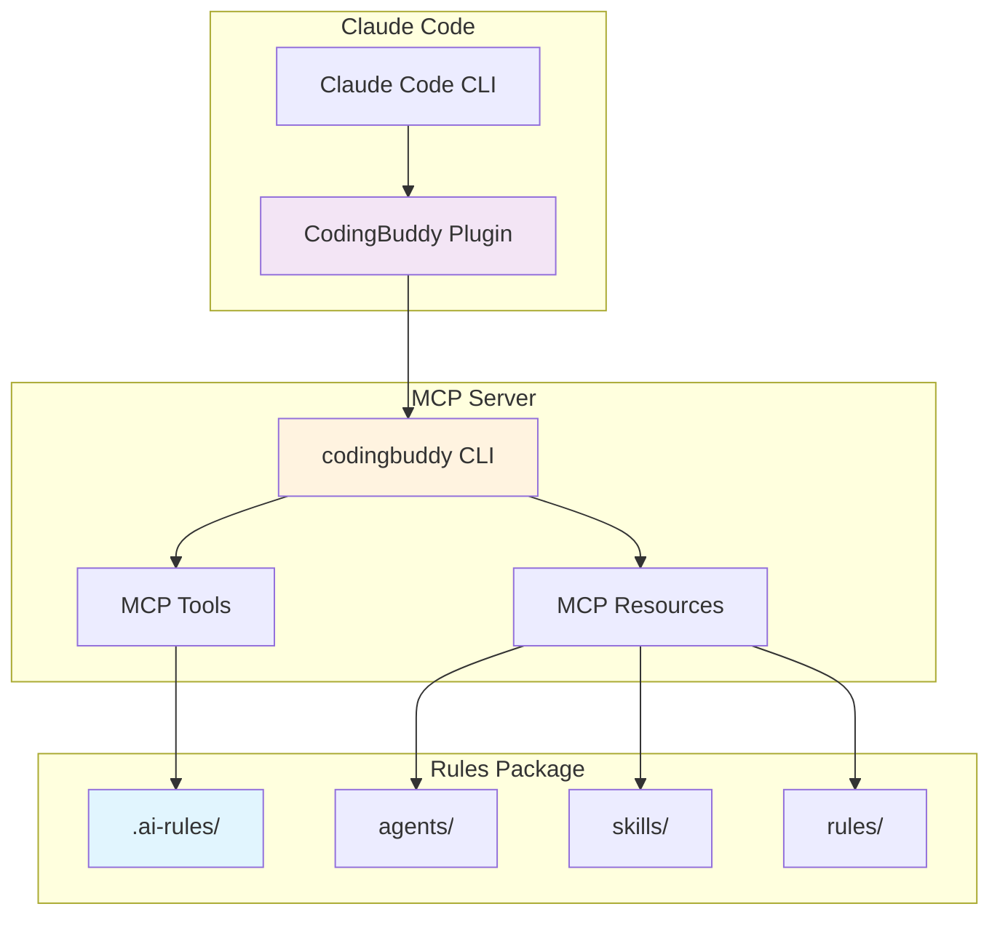
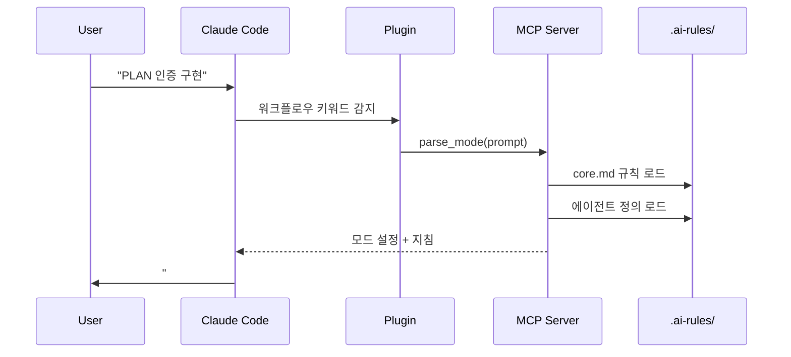
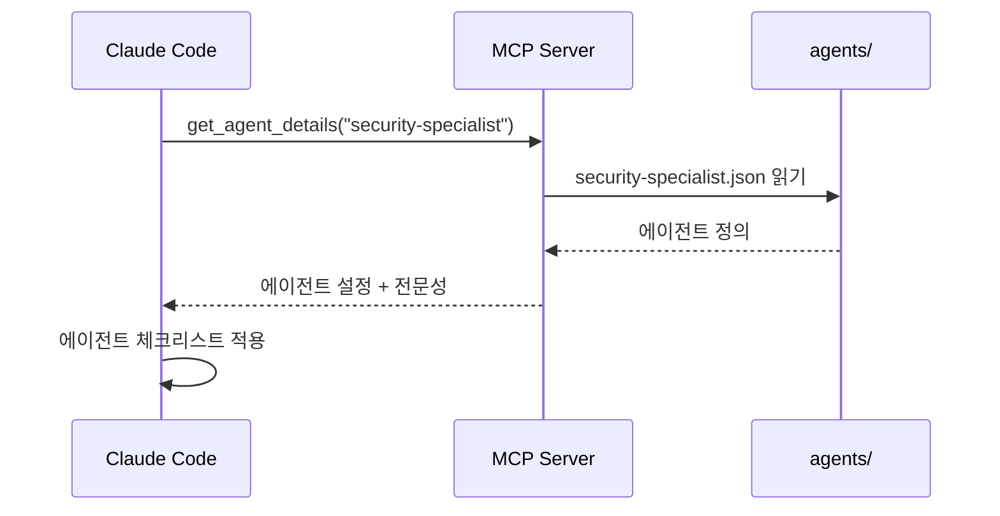
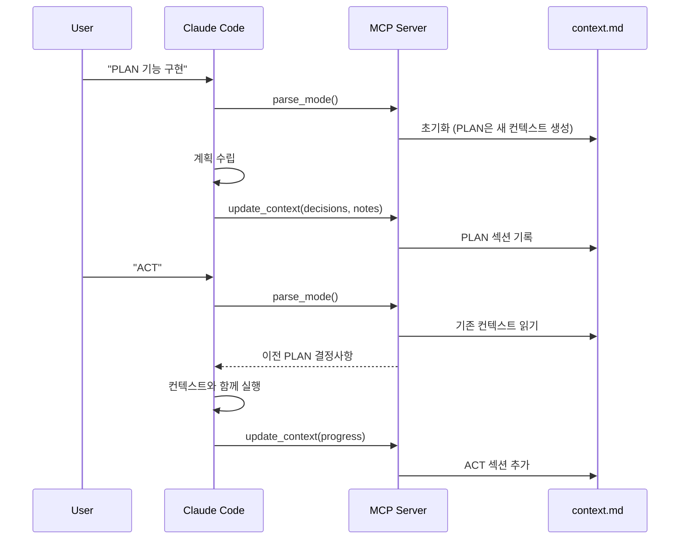

<p align="center">
  <a href="../plugin-architecture.md">English</a> |
  <a href="plugin-architecture.md">한국어</a> |
  <a href="../zh-CN/plugin-architecture.md">中文</a> |
  <a href="../ja/plugin-architecture.md">日本語</a> |
  <a href="../es/plugin-architecture.md">Español</a> |
  <a href="../pt-BR/plugin-architecture.md">Português</a>
</p>

# CodingBuddy 플러그인 아키텍처

이 문서는 CodingBuddy Claude Code 플러그인의 작동 방식, 구성 요소, 그리고 이들 간의 상호작용을 설명합니다.

## 개요

CodingBuddy는 **씬 플러그인(thin plugin)** 아키텍처를 사용합니다. Claude Code 플러그인은 가벼운 진입점 역할을 하고, MCP 서버가 실제 기능을 제공합니다.



## 아키텍처 레이어

### 레이어 1: Claude Code 플러그인

**위치**: `packages/claude-code-plugin/`

**목적**: Claude Code 연동을 위한 진입점

**구성 요소**:
| 파일 | 목적 |
|------|------|
| `.claude-plugin/plugin.json` | 플러그인 매니페스트 (이름, 버전, 설명) |
| `.mcp.json` | MCP 서버 설정 |
| `commands/*.md` | Claude용 명령어 문서 |
| `README.md` | 플러그인 개요 |

**핵심 포인트**: 플러그인은 의도적으로 가볍게 설계되었습니다:
- **비즈니스 로직 없음** - 모든 로직은 MCP 서버에 존재
- **에이전트 정의 없음** - 모든 에이전트는 `.ai-rules/`에 존재
- **스킬 구현 없음** - 모든 스킬은 `.ai-rules/`에 존재

### 레이어 2: MCP 서버

**위치**: `apps/mcp-server/` (`codingbuddy` CLI를 통해)

**목적**: Model Context Protocol을 통해 도구와 리소스 제공

**MCP 도구**:
| 도구 | 설명 |
|------|------|
| `parse_mode` | 사용자 프롬프트에서 PLAN/ACT/EVAL/AUTO 파싱 |
| `get_agent_details` | 전문가 에이전트 설정 조회 |
| `prepare_parallel_agents` | 병렬 실행을 위한 에이전트 준비 |
| `generate_checklist` | 도메인별 체크리스트 생성 |
| `analyze_task` | 추천을 위한 작업 분석 |
| `read_context` | 세션 컨텍스트 문서 읽기 |
| `update_context` | 진행 상황으로 컨텍스트 업데이트 |
| `get_project_config` | 프로젝트 설정 조회 |
| `recommend_skills` | 작업에 맞는 스킬 추천 |

**MCP 리소스**:
| 리소스 | URI 패턴 | 설명 |
|--------|----------|------|
| Agents | `agent://{name}` | 전문가 에이전트 정의 |
| Skills | `skill://{name}` | 재사용 가능한 워크플로우 정의 |
| Rules | `rules://{name}` | 핵심 규칙 (core.md, project.md) |

### 레이어 3: 규칙 패키지

**위치**: `packages/rules/.ai-rules/`

**목적**: 모든 정의의 단일 진실 공급원(Single Source of Truth)

**구조**:
```
.ai-rules/
├── agents/           # 전문가 에이전트 정의 (JSON)
│   ├── frontend-developer.json
│   ├── backend-developer.json
│   ├── security-specialist.json
│   └── ... (12개 이상의 에이전트)
├── skills/           # 재사용 가능한 워크플로우 (Markdown)
│   ├── tdd.md
│   ├── debugging.md
│   ├── api-design.md
│   └── ... (14개 이상의 스킬)
├── rules/            # 핵심 규칙
│   ├── core.md       # PLAN/ACT/EVAL/AUTO 모드
│   ├── project.md    # 프로젝트 설정, 아키텍처
│   └── augmented-coding.md  # TDD, 코드 품질
└── adapters/         # 도구별 가이드
    ├── claude-code.md
    ├── cursor.md
    └── ...
```

## 데이터 흐름

### 워크플로우 모드 활성화



### 전문가 에이전트 활성화



### 컨텍스트 유지



## 핵심 설계 원칙

### 1. 단일 진실 공급원

모든 에이전트, 스킬, 규칙 정의는 `packages/rules/.ai-rules/`에 존재합니다. 이를 통해:

- **중복 없음** - 정의가 정확히 한 곳에만 존재
- **일관성** - 모든 도구(Cursor, Claude Code 등)가 동일한 정의 사용
- **유지보수 용이** - 한 번 수정하면 모든 곳에 반영

### 2. 씬 플러그인, 리치 서버

플러그인은 최소한의 코드만 포함:
- Claude Code 탐색을 위한 플러그인 매니페스트
- 서버를 가리키는 MCP 설정
- 명령어 문서

모든 로직, 에이전트, 스킬은 MCP 서버가 제공합니다.

### 3. 프로토콜 기반 통신

플러그인은 Model Context Protocol을 사용하여 MCP 서버와 통신합니다:

```json
// 요청
{
  "jsonrpc": "2.0",
  "method": "tools/call",
  "params": {
    "name": "parse_mode",
    "arguments": { "prompt": "PLAN 인증 구현" }
  }
}

// 응답
{
  "jsonrpc": "2.0",
  "result": {
    "mode": "PLAN",
    "instructions": "...",
    "agent": "solution-architect"
  }
}
```

### 4. 컴팩션에서 컨텍스트 유지

컨텍스트는 `docs/codingbuddy/context.md`에 저장됩니다:
- Claude의 컨텍스트 윈도우가 가득 차면 이전 메시지가 요약됨
- 컨텍스트 문서는 중요한 결정사항과 노트를 보존
- 컴팩션 후에도 ACT 모드가 PLAN 결정사항을 읽을 수 있음

## 설정 파일

### 플러그인 매니페스트 (`plugin.json`)

```json
{
  "$schema": "https://anthropic.com/claude-code/plugin.schema.json",
  "name": "codingbuddy",
  "version": "2.4.1",
  "description": "일관된 코딩 관행을 위한 Multi-AI 규칙"
}
```

### MCP 설정 (`.mcp.json`)

```json
{
  "mcpServers": {
    "codingbuddy": {
      "command": "codingbuddy",
      "args": []
    }
  }
}
```

### 프로젝트 설정 (`codingbuddy.config.js`)

```javascript
module.exports = {
  language: 'ko',
  defaultMode: 'PLAN',
  specialists: ['security-specialist', 'performance-specialist']
};
```

## 폴백 동작

### MCP 서버를 사용할 수 없을 때

`codingbuddy` CLI가 설치되지 않은 경우:

1. 플러그인은 여전히 Claude Code에 로드됨
2. 명령어 문서는 사용 가능
3. MCP 도구는 오류 반환
4. 워크플로우 모드는 제한된 모드로 작동 (컨텍스트 유지 불가)

### 권장 설정

모든 기능을 사용하려면:
1. 마켓플레이스 추가: `claude marketplace add https://jeremydev87.github.io/codingbuddy`
2. 플러그인 설치: `claude plugin install codingbuddy@jeremydev87`
3. MCP 서버 설치: `npm install -g codingbuddy`
4. Claude 설정에 MCP 구성

## 버전 관리

### 버전 동기화

플러그인은 버전 동기화를 위한 빌드 스크립트를 사용합니다:

```bash
# packages/claude-code-plugin/에서
npm run sync-version
```

이를 통해 `plugin.json` 버전이 `package.json`과 일치합니다.

### 호환성 매트릭스

| 플러그인 버전 | MCP 서버 버전 | 호환성 |
|---------------|---------------|--------|
| 3.0.x | 3.0.x | ✅ |
| 2.x | 2.x | ✅ |
| 3.x | 2.x | ⚠️ 부분 호환 |

## 관련 문서

- [설치 가이드](./plugin-guide.md) - 설치 방법
- [빠른 참조](./plugin-quick-reference.md) - 명령어와 모드
- [예시](./plugin-examples.md) - 실제 워크플로우
- [문제 해결](./plugin-troubleshooting.md) - 일반적인 문제

---

<sub>🤖 이 문서는 AI의 도움을 받아 번역되었습니다. 오류나 개선 사항이 있으면 [GitHub Issues](https://github.com/JeremyDev87/codingbuddy/issues)에 알려주세요.</sub>
