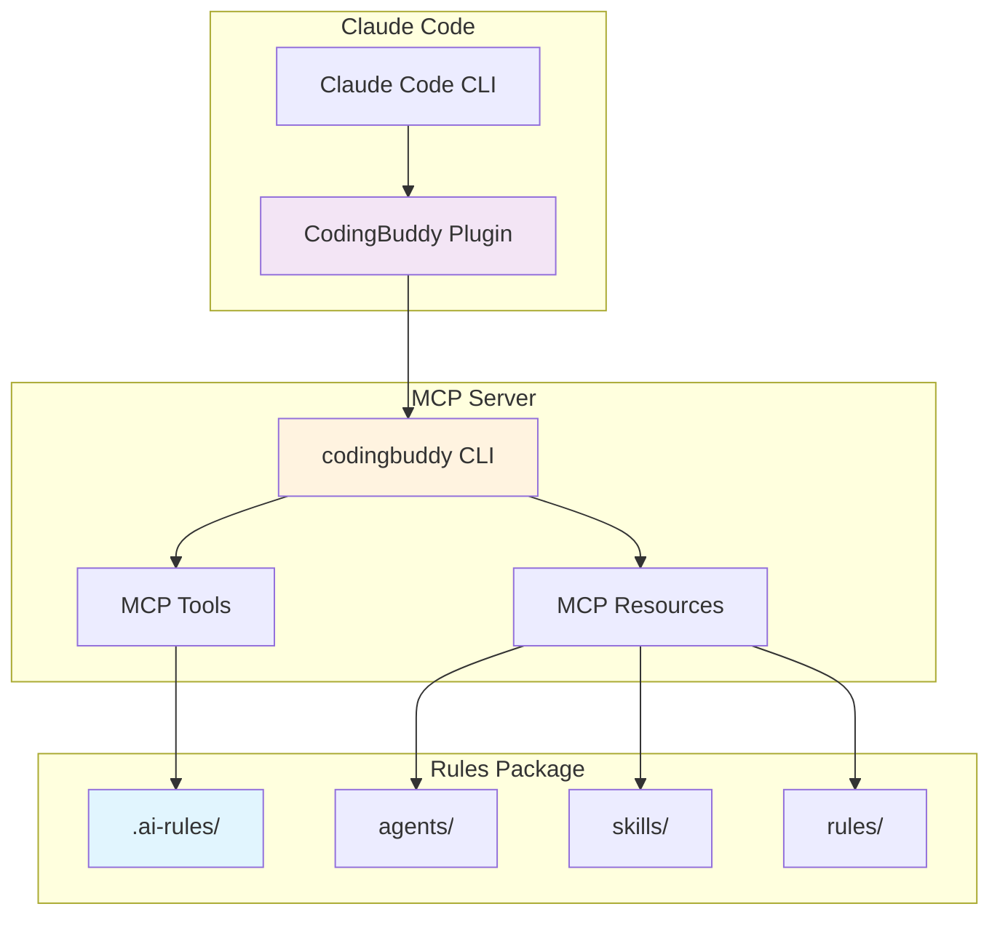
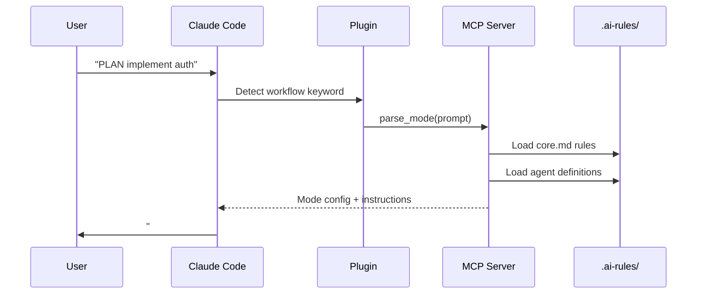
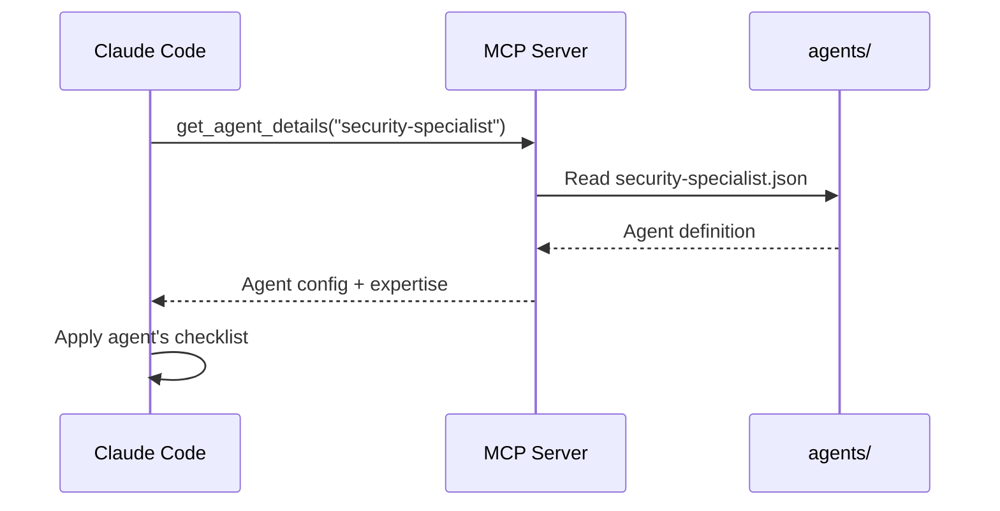
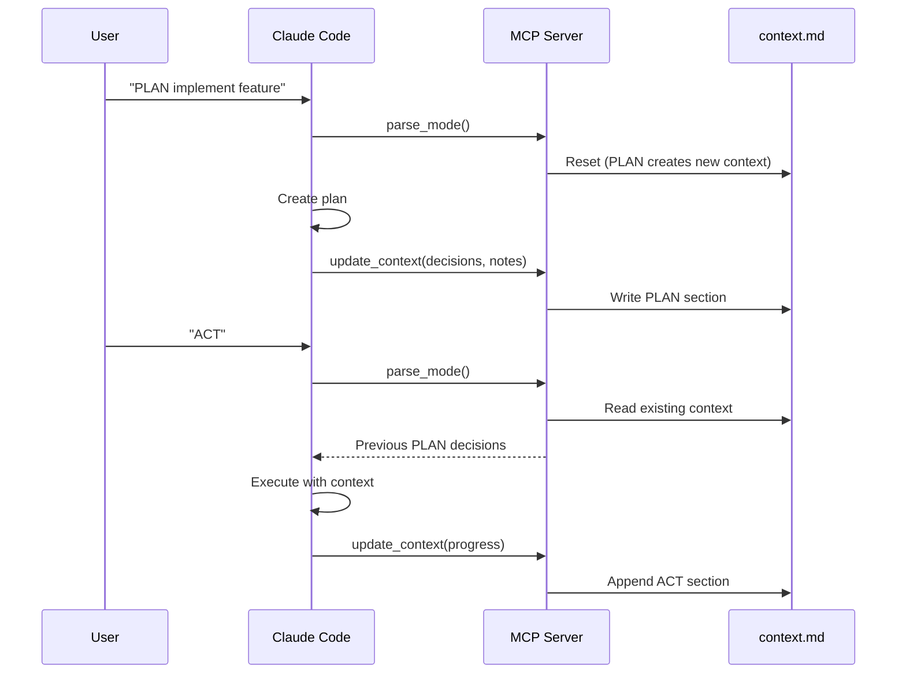

<p align="center">
  <a href="plugin-architecture.md">English</a> |
  <a href="ko/plugin-architecture.md">한국어</a> |
  <a href="zh-CN/plugin-architecture.md">中文</a> |
  <a href="ja/plugin-architecture.md">日本語</a> |
  <a href="es/plugin-architecture.md">Español</a> |
  <a href="pt-BR/plugin-architecture.md">Português</a>
</p>

# CodingBuddy Plugin Architecture

This document explains how the CodingBuddy Claude Code Plugin works, its components, and how they interact.

## Overview

CodingBuddy uses a **thin plugin** architecture where the Claude Code Plugin serves as a lightweight entry point, while the MCP server provides the actual functionality.



## Architecture Layers

### Layer 1: Claude Code Plugin

**Location**: `packages/claude-code-plugin/`

**Purpose**: Entry point for Claude Code integration

**Components**:
| File | Purpose |
|------|---------|
| `.claude-plugin/plugin.json` | Plugin manifest (name, version, description) |
| `.mcp.json` | MCP server configuration |
| `commands/*.md` | Command documentation for Claude |
| `README.md` | Plugin overview |

**Key Insight**: The plugin is intentionally thin. It contains:
- **No business logic** - All logic lives in the MCP server
- **No agent definitions** - All agents live in `.ai-rules/`
- **No skill implementations** - All skills live in `.ai-rules/`

### Layer 2: MCP Server

**Location**: `apps/mcp-server/` (via `codingbuddy` CLI)

**Purpose**: Provides tools and resources via Model Context Protocol

**MCP Tools**:
| Tool | Description |
|------|-------------|
| `parse_mode` | Parse PLAN/ACT/EVAL/AUTO from user prompt |
| `get_agent_details` | Get specialist agent configuration |
| `prepare_parallel_agents` | Prepare agents for parallel execution |
| `generate_checklist` | Generate domain-specific checklists |
| `analyze_task` | Analyze task for recommendations |
| `read_context` | Read session context document |
| `update_context` | Update context with progress |
| `get_project_config` | Get project configuration |
| `recommend_skills` | Recommend skills for a task |

**MCP Resources**:
| Resource | URI Pattern | Description |
|----------|-------------|-------------|
| Agents | `agent://{name}` | Specialist agent definitions |
| Skills | `skill://{name}` | Reusable workflow definitions |
| Rules | `rules://{name}` | Core rules (core.md, project.md) |

### Layer 3: Rules Package

**Location**: `packages/rules/.ai-rules/`

**Purpose**: Single source of truth for all definitions

**Structure**:
```
.ai-rules/
├── agents/           # Specialist agent definitions (JSON)
│   ├── frontend-developer.json
│   ├── backend-developer.json
│   ├── security-specialist.json
│   └── ... (12+ agents)
├── skills/           # Reusable workflows (Markdown)
│   ├── tdd.md
│   ├── debugging.md
│   ├── api-design.md
│   └── ... (14+ skills)
├── rules/            # Core rules
│   ├── core.md       # PLAN/ACT/EVAL/AUTO modes
│   ├── project.md    # Project setup, architecture
│   └── augmented-coding.md  # TDD, code quality
└── adapters/         # Tool-specific guides
    ├── claude-code.md
    ├── cursor.md
    └── ...
```

## Data Flow

### Workflow Mode Activation



### Specialist Agent Activation



### Context Persistence



## Key Design Principles

### 1. Single Source of Truth

All agent, skill, and rule definitions live in `packages/rules/.ai-rules/`. This ensures:

- **No duplication** - Definitions exist in exactly one place
- **Consistency** - All tools (Cursor, Claude Code, etc.) use the same definitions
- **Easy maintenance** - Update once, propagate everywhere

### 2. Thin Plugin, Rich Server

The plugin contains minimal code:
- Plugin manifest for Claude Code discovery
- MCP configuration pointing to the server
- Command documentation

All logic, agents, and skills are served by the MCP server.

### 3. Protocol-Based Communication

The plugin communicates with the MCP server using the Model Context Protocol:

```json
// Request
{
  "jsonrpc": "2.0",
  "method": "tools/call",
  "params": {
    "name": "parse_mode",
    "arguments": { "prompt": "PLAN implement auth" }
  }
}

// Response
{
  "jsonrpc": "2.0",
  "result": {
    "mode": "PLAN",
    "instructions": "...",
    "agent": "solution-architect"
  }
}
```

### 4. Context Survives Compaction

Context is persisted to `docs/codingbuddy/context.md`:
- When Claude's context window fills, older messages are summarized
- The context document preserves critical decisions and notes
- ACT mode can read PLAN decisions even after compaction

## Configuration Files

### Plugin Manifest (`plugin.json`)

```json
{
  "$schema": "https://anthropic.com/claude-code/plugin.schema.json",
  "name": "codingbuddy",
  "version": "2.4.1",
  "description": "Multi-AI Rules for consistent coding practices"
}
```

### MCP Configuration (`.mcp.json`)

```json
{
  "mcpServers": {
    "codingbuddy": {
      "command": "codingbuddy",
      "args": []
    }
  }
}
```

### Project Configuration (`codingbuddy.config.js`)

```javascript
module.exports = {
  language: 'en',
  defaultMode: 'PLAN',
  specialists: ['security-specialist', 'performance-specialist']
};
```

## Fallback Behavior

### When MCP Server is Unavailable

If the `codingbuddy` CLI is not installed:

1. Plugin still loads in Claude Code
2. Command documentation is available
3. MCP tools return errors
4. Workflow modes work in degraded mode (no context persistence)

### Recommended Setup

For full functionality:
1. Add marketplace: `claude marketplace add JeremyDev87/codingbuddy`
2. Install plugin: `claude plugin install codingbuddy@jeremydev87`
3. Install MCP server: `npm install -g codingbuddy`
4. Configure MCP in Claude settings

## Versioning

### Version Synchronization

The plugin uses a build script to sync versions:

```bash
# In packages/claude-code-plugin/
npm run sync-version
```

This ensures `plugin.json` version matches `package.json`.

### Compatibility Matrix

| Plugin Version | MCP Server Version | Compatible |
|---------------|-------------------|------------|
| 3.0.x | 3.0.x | ✅ |
| 2.x | 2.x | ✅ |
| 3.x | 2.x | ⚠️ Partial |

## See Also

- [Installation Guide](./plugin-guide.md) - Setup instructions
- [Quick Reference](./plugin-quick-reference.md) - Commands and modes
- [Examples](./plugin-examples.md) - Real-world workflows
- [Troubleshooting](./plugin-troubleshooting.md) - Common issues
