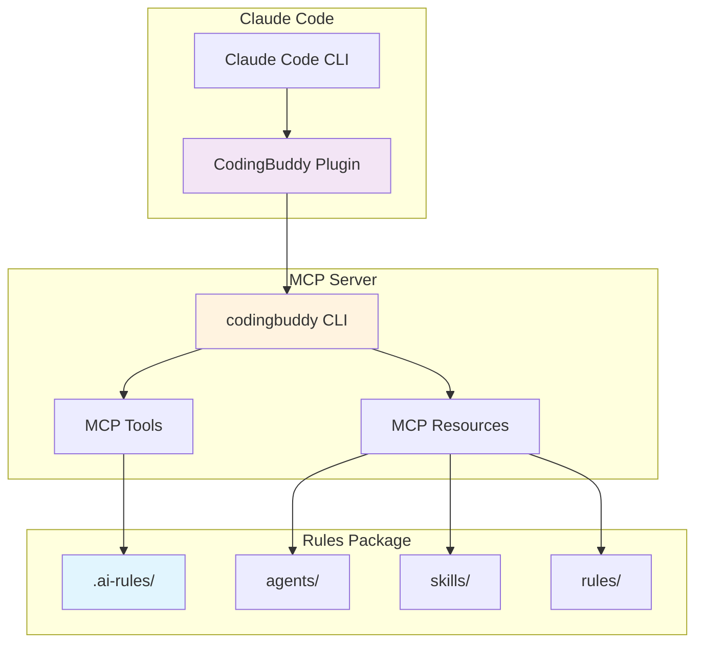
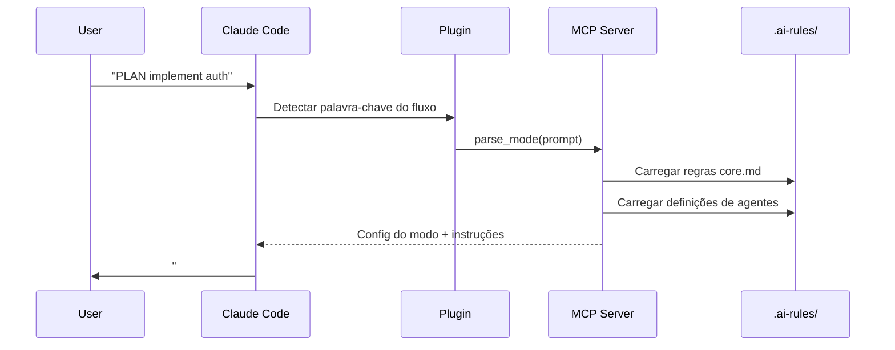
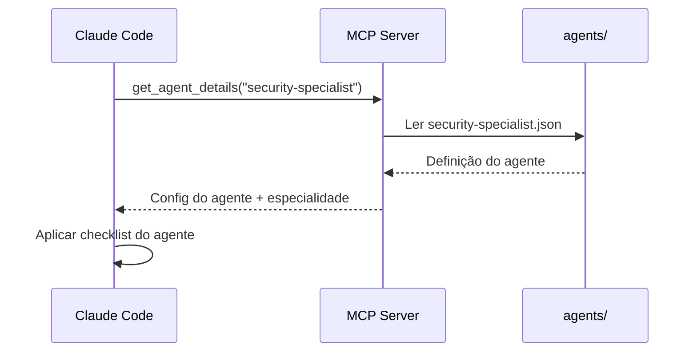
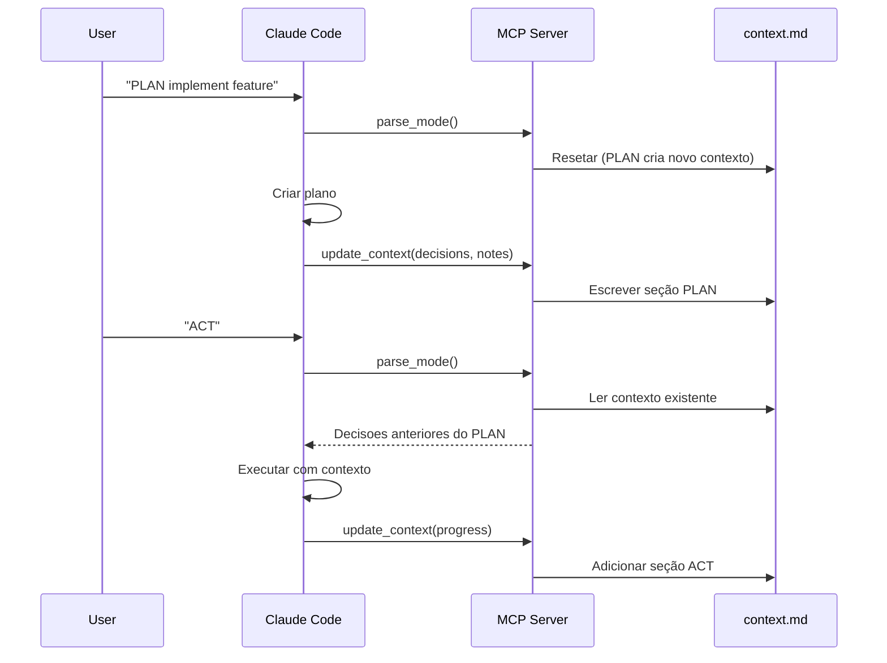

<p align="center">
  <a href="../plugin-architecture.md">English</a> |
  <a href="../ko/plugin-architecture.md">한국어</a> |
  <a href="../zh-CN/plugin-architecture.md">中文</a> |
  <a href="../ja/plugin-architecture.md">日本語</a> |
  <a href="../es/plugin-architecture.md">Español</a> |
  <a href="plugin-architecture.md">Português</a>
</p>

# Arquitetura do Plugin CodingBuddy

Este documento explica como o Plugin CodingBuddy para Claude Code funciona, seus componentes e como eles interágem.

## Visão Geral

O CodingBuddy usa uma arquitetura de **plugin leve** onde o Plugin Claude Code serve como um ponto de entrada minimalista, enquanto o servidor MCP fornece a funcionalidade real.



## Camadas da Arquitetura

### Camada 1: Plugin Claude Code

**Localização**: `packages/claude-code-plugin/`

**Proposito**: Ponto de entrada para integração com Claude Code

**Componentes**:
| Arquivo | Proposito |
|---------|-----------|
| `.claude-plugin/plugin.json` | Manifesto do plugin (nome, versão, descrição) |
| `.mcp.json` | Configuração do servidor MCP |
| `commands/*.md` | Documentação de comandos para o Claude |
| `README.md` | Visão geral do plugin |

**Insight Principal**: O plugin e intencionalmente leve. Ele contem:
- **Nenhuma lógica de negocios** - Toda lógica esta no servidor MCP
- **Nenhuma definição de agente** - Todos os agentes estão em `.ai-rules/`
- **Nenhuma implementação de habilidade** - Todas as habilidades estão em `.ai-rules/`

### Camada 2: Servidor MCP

**Localização**: `apps/mcp-server/` (via CLI `codingbuddy`)

**Proposito**: Fornece ferramentas e recursos via Model Context Protocol

**Ferramentas MCP**:
| Ferramenta | Descrição |
|------------|-----------|
| `parse_mode` | Analisar PLAN/ACT/EVAL/AUTO do prompt do usuario |
| `get_agent_details` | Obter configuração do agente especialista |
| `prepare_parallel_agents` | Preparar agentes para execução paralela |
| `generate_checklist` | Gerar checklists específicos de dominio |
| `analyze_task` | Analisar tarefa para recomendações |
| `read_context` | Ler documento de contexto da sessão |
| `update_context` | Atualizar contexto com progressó |
| `get_project_config` | Obter configuração do projeto |
| `recommend_skills` | Recomendar habilidades para uma tarefa |

**Recursos MCP**:
| Recurso | Padrão URI | Descrição |
|---------|------------|-----------|
| Agents | `agent://{name}` | Definições de agentes especialistas |
| Skills | `skill://{name}` | Definições de fluxos de trabalho reutilizaveis |
| Rules | `rules://{name}` | Regras centrais (core.md, project.md) |

### Camada 3: Pacote de Regras

**Localização**: `packages/rules/.ai-rules/`

**Proposito**: Fonte unica de verdade para todas as definições

**Estrutura**:
```
.ai-rules/
├── agents/           # Definições de agentes especialistas (JSON)
│   ├── frontend-developer.json
│   ├── backend-developer.json
│   ├── security-specialist.json
│   └── ... (12+ agentes)
├── skills/           # Fluxos de trabalho reutilizaveis (Markdown)
│   ├── tdd.md
│   ├── debugging.md
│   ├── api-design.md
│   └── ... (14+ habilidades)
├── rules/            # Regras centrais
│   ├── core.md       # Modos PLAN/ACT/EVAL/AUTO
│   ├── project.md    # Configuração do projeto, arquitetura
│   └── augmented-coding.md  # TDD, qualidade de código
└── adapters/         # Guias específicos por ferramenta
    ├── claude-code.md
    ├── cursor.md
    └── ...
```

## Fluxo de Dados

### Ativação do Modo de Fluxo de Trabalho



### Ativação do Agente Especialista



### Persistência de Contexto



## Principios de Design Principais

### 1. Fonte Unica de Verdade

Todas as definições de agentes, habilidades e regras estão em `packages/rules/.ai-rules/`. Isso garante:

- **Sem duplicação** - Definições existem em exatamente um lugar
- **Consistencia** - Todas as ferramentas (Cursor, Claude Code, etc.) usam as mesmas definições
- **Facil manutenção** - Atualizar uma vez, propagar em todos os lugares

### 2. Plugin Leve, Servidor Rico

O plugin contem código mínimo:
- Manifesto do plugin para descoberta pelo Claude Code
- Configuração MCP apontando para o servidor
- Documentação de comandos

Toda lógica, agentes e habilidades são servidos pelo servidor MCP.

### 3. Comunicação Baseada em Protocolo

O plugin se comunica com o servidor MCP usando o Model Context Protocol:

```json
// Requisição
{
  "jsonrpc": "2.0",
  "method": "tools/call",
  "params": {
    "name": "parse_mode",
    "arguments": { "prompt": "PLAN implement auth" }
  }
}

// Resposta
{
  "jsonrpc": "2.0",
  "result": {
    "mode": "PLAN",
    "instructions": "...",
    "agent": "solution-architect"
  }
}
```

### 4. Contexto Sobrevive a Compactação

O contexto e persistido em `docs/codingbuddy/context.md`:
- Quando a janela de contexto do Claude enche, mensagens antigas são resumidas
- O documento de contexto preserva decisões e notas críticas
- O modo ACT pode ler decisões do PLAN mesmo após compactação

## Arquivos de Configuração

### Manifesto do Plugin (`plugin.json`)

```json
{
  "$schema": "https://anthropic.com/claude-code/plugin.schema.json",
  "name": "codingbuddy",
  "version": "2.4.1",
  "description": "Multi-AI Rules for consistent coding practices"
}
```

### Configuração MCP (`.mcp.json`)

```json
{
  "mcpServers": {
    "codingbuddy": {
      "command": "codingbuddy",
      "args": []
    }
  }
}
```

### Configuração do Projeto (`codingbuddy.config.js`)

```javascript
module.exports = {
  language: 'en',
  defaultMode: 'PLAN',
  specialists: ['security-specialist', 'performance-specialist']
};
```

## Comportamento de Fallback

### Quando o Servidor MCP Não Esta Disponível

Se o CLI `codingbuddy` não está instalado:

1. O plugin ainda carrega no Claude Code
2. Documentação de comandos está disponível
3. Ferramentas MCP retornam erros
4. Modos de fluxo de trabalho funcionam em modo degradado (sem persistência de contexto)

### Configuração Recomendada

Para funcionalidade completa:
1. Instalar plugin: `claude plugin add codingbuddy`
2. Instalar servidor MCP: `npm install -g codingbuddy`
3. Configurar MCP nas configurações do Claude

## Versionamento

### Sincronização de Versão

O plugin usa um script de build para sincronizar versoes:

```bash
# Em packages/claude-code-plugin/
npm run sync-version
```

Isso garante que a versão do `plugin.json` corresponda ao `package.json`.

### Matriz de Compatibilidade

| Versão do Plugin | Versão do Servidor MCP | Compatível |
|------------------|------------------------|------------|
| 3.0.x | 3.0.x | ✅ |
| 2.x | 2.x | ✅ |
| 3.x | 2.x | ⚠️ Parcial |

## Vejá Também

- [Guia de Instalação](./plugin-guide.md) - Instruções de configuração
- [Referência Rapida](./plugin-quick-reference.md) - Comandos e modos
- [Exemplos](./plugin-examples.md) - Fluxos de trabalho reais
- [Solução de Problemas](./plugin-troubleshooting.md) - Problemas comuns

---

<sub>🤖 Este documento foi traduzido com assistência de IA. Se encontrar erros ou tiver sugestões de melhoria, por favor reporte em [GitHub Issues](https://github.com/JeremyDev87/codingbuddy/issues).</sub>
