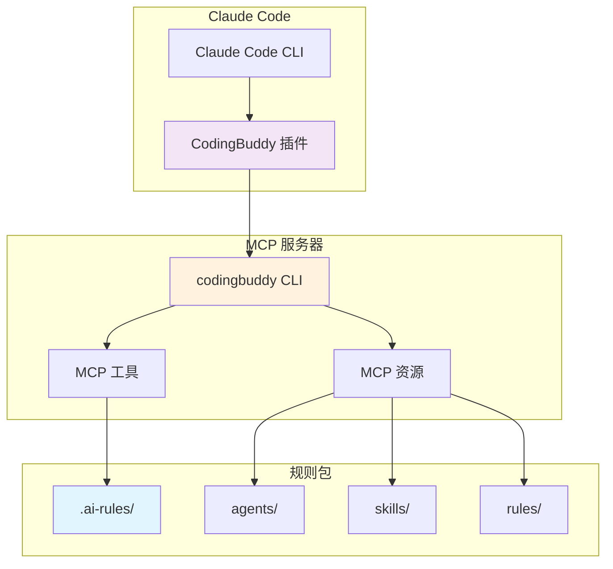
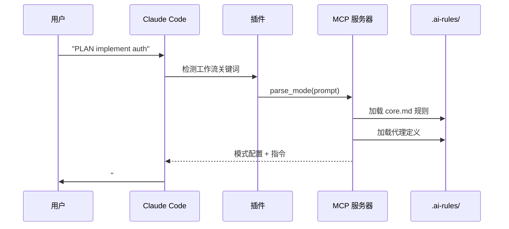
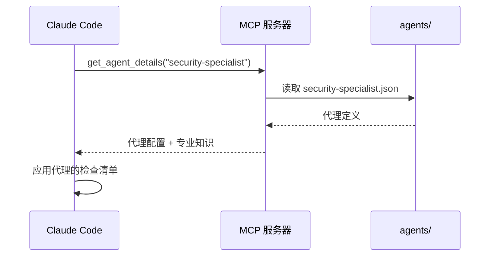
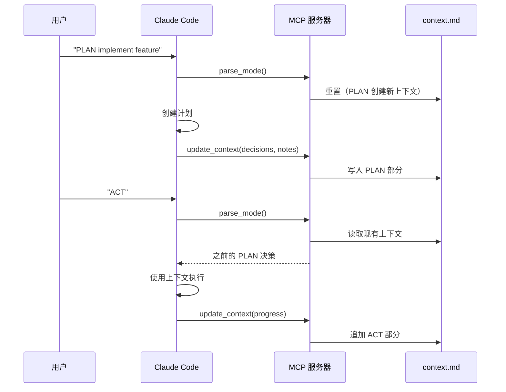

<p align="center">
  <a href="../plugin-architecture.md">English</a> |
  <a href="../ko/plugin-architecture.md">한국어</a> |
  <a href="plugin-architecture.md">中文</a> |
  <a href="../ja/plugin-architecture.md">日本語</a> |
  <a href="../es/plugin-architecture.md">Español</a> |
  <a href="../pt-BR/plugin-architecture.md">Português</a>
</p>

# CodingBuddy 插件架构

本文档介绍 CodingBuddy Claude Code 插件的工作原理、组件以及它们之间的交互方式。

## 概述

CodingBuddy 采用**轻量级插件**架构，其中 Claude Code 插件作为轻量级入口点，而 MCP 服务器提供实际功能。



## 架构层次

### 第一层：Claude Code 插件

**位置**：`packages/claude-code-plugin/`

**用途**：Claude Code 集成的入口点

**组件**：
| 文件 | 用途 |
|------|---------|
| `.claude-plugin/plugin.json` | 插件清单（名称、版本、描述） |
| `.mcp.json` | MCP 服务器配置 |
| `commands/*.md` | Claude 的命令文档 |
| `README.md` | 插件概述 |

**关键洞察**：插件故意设计得很轻量。它包含：
- **无业务逻辑** - 所有逻辑都在 MCP 服务器中
- **无代理定义** - 所有代理都在 `.ai-rules/` 中
- **无技能实现** - 所有技能都在 `.ai-rules/` 中

### 第二层：MCP 服务器

**位置**：`apps/mcp-server/`（通过 `codingbuddy` CLI）

**用途**：通过 Model Context Protocol 提供工具和资源

**MCP 工具**：
| 工具 | 描述 |
|------|-------------|
| `parse_mode` | 从用户提示中解析 PLAN/ACT/EVAL/AUTO |
| `get_agent_details` | 获取专家代理配置 |
| `prepare_parallel_agents` | 准备代理进行并行执行 |
| `generate_checklist` | 生成领域特定的检查清单 |
| `analyze_task` | 分析任务以获取建议 |
| `read_context` | 读取会话上下文文档 |
| `update_context` | 更新上下文进度 |
| `get_project_config` | 获取项目配置 |
| `recommend_skills` | 为任务推荐技能 |

**MCP 资源**：
| 资源 | URI 模式 | 描述 |
|----------|-------------|-------------|
| 代理 | `agent://{name}` | 专家代理定义 |
| 技能 | `skill://{name}` | 可重用工作流定义 |
| 规则 | `rules://{name}` | 核心规则（core.md、project.md） |

### 第三层：规则包

**位置**：`packages/rules/.ai-rules/`

**用途**：所有定义的唯一真实来源

**结构**：
```
.ai-rules/
├── agents/           # 专家代理定义（JSON）
│   ├── frontend-developer.json
│   ├── backend-developer.json
│   ├── security-specialist.json
│   └── ...（12+ 个代理）
├── skills/           # 可重用工作流（Markdown）
│   ├── tdd.md
│   ├── debugging.md
│   ├── api-design.md
│   └── ...（14+ 个技能）
├── rules/            # 核心规则
│   ├── core.md       # PLAN/ACT/EVAL/AUTO 模式
│   ├── project.md    # 项目设置、架构
│   └── augmented-coding.md  # TDD、代码质量
└── adapters/         # 工具特定指南
    ├── claude-code.md
    ├── cursor.md
    └── ...
```

## 数据流

### 工作流模式激活



### 专家代理激活



### 上下文持久化



## 关键设计原则

### 1. 唯一真实来源

所有代理、技能和规则定义都存放在 `packages/rules/.ai-rules/`。这确保了：

- **无重复** - 定义只存在于一个地方
- **一致性** - 所有工具（Cursor、Claude Code 等）使用相同的定义
- **易于维护** - 更新一次，到处生效

### 2. 轻量级插件，丰富的服务器

插件包含最少的代码：
- 用于 Claude Code 发现的插件清单
- 指向服务器的 MCP 配置
- 命令文档

所有逻辑、代理和技能都由 MCP 服务器提供。

### 3. 基于协议的通信

插件使用 Model Context Protocol 与 MCP 服务器通信：

```json
// 请求
{
  "jsonrpc": "2.0",
  "method": "tools/call",
  "params": {
    "name": "parse_mode",
    "arguments": { "prompt": "PLAN implement auth" }
  }
}

// 响应
{
  "jsonrpc": "2.0",
  "result": {
    "mode": "PLAN",
    "instructions": "...",
    "agent": "solution-architect"
  }
}
```

### 4. 上下文在压缩后保留

上下文持久化到 `docs/codingbuddy/context.md`：
- 当 Claude 的上下文窗口填满时，旧消息会被摘要
- 上下文文档保留关键决策和笔记
- 即使在压缩后，ACT 模式也能读取 PLAN 决策

## 配置文件

### 插件清单（`plugin.json`）

```json
{
  "$schema": "https://anthropic.com/claude-code/plugin.schema.json",
  "name": "codingbuddy",
  "version": "2.4.1",
  "description": "Multi-AI Rules for consistent coding practices"
}
```

### MCP 配置（`.mcp.json`）

```json
{
  "mcpServers": {
    "codingbuddy": {
      "command": "codingbuddy",
      "args": []
    }
  }
}
```

### 项目配置（`codingbuddy.config.js`）

```javascript
module.exports = {
  language: 'zh',
  defaultMode: 'PLAN',
  specialists: ['security-specialist', 'performance-specialist']
};
```

## 降级行为

### 当 MCP 服务器不可用时

如果 `codingbuddy` CLI 未安装：

1. 插件仍会在 Claude Code 中加载
2. 命令文档可用
3. MCP 工具返回错误
4. 工作流模式以降级模式工作（无上下文持久化）

### 推荐设置

要获得完整功能：
1. 添加市场：`claude marketplace add JeremyDev87/codingbuddy`
2. 安装插件：`claude plugin install codingbuddy@jeremydev87`
3. 安装 MCP 服务器：`npm install -g codingbuddy`
4. 在 Claude 设置中配置 MCP

## 版本管理

### 版本同步

插件使用构建脚本同步版本：

```bash
# 在 packages/claude-code-plugin/ 中
npm run sync-version
```

这确保 `plugin.json` 版本与 `package.json` 匹配。

### 兼容性矩阵

| 插件版本 | MCP 服务器版本 | 兼容性 |
|---------------|-------------------|------------|
| 3.0.x | 3.0.x | ✅ |
| 2.x | 2.x | ✅ |
| 3.x | 2.x | ⚠️ 部分兼容 |

## 另请参阅

- [安装指南](./plugin-guide.md) - 设置说明
- [快速参考](./plugin-quick-reference.md) - 命令和模式
- [示例](./plugin-examples.md) - 真实工作流
- [故障排除](./plugin-troubleshooting.md) - 常见问题

---

<sub>🤖 本文档由AI辅助翻译。如有错误或改进建议，请在 [GitHub Issues](https://github.com/JeremyDev87/codingbuddy/issues) 中反馈。</sub>
