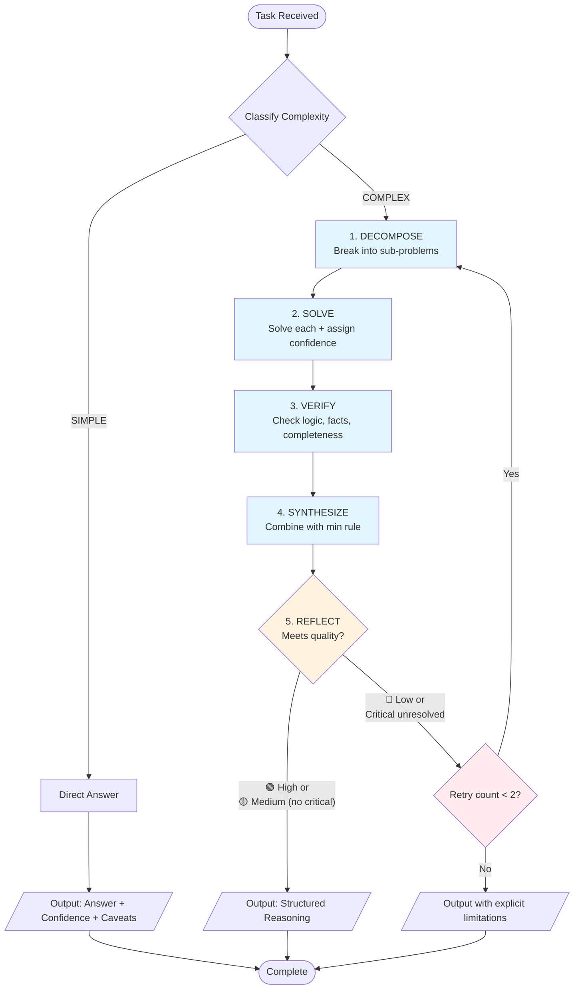

# Structured Reasoning Process (SRP) Guide

A systematic approach to enhance PLAN mode's planning capabilities through structured thinking.

## Overview

The Structured Reasoning Process (SRP) is a 5-step framework that improves planning quality by:
- Breaking down complex problems systematically
- Providing explicit confidence levels for transparency
- Verifying logic and completeness before output
- Enabling iterative refinement when needed

**When Applied**: Automatically for COMPLEX tasks, skipped for SIMPLE tasks.

---

## Process Flowchart



**Legend:**
- 🔵 Blue boxes: Core SRP steps
- 🟠 Orange diamond: Quality decision point
- 🔴 Red diamond: Retry decision

<details>
<summary>📄 Text Fallback (for non-Mermaid environments)</summary>

```
                    ┌─────────────────┐
                    │  Task Received  │
                    └────────┬────────┘
                             │
                    ┌────────▼────────┐
                    │    SIMPLE or    │
                    │    COMPLEX?     │
                    └────────┬────────┘
               ┌─────────────┴─────────────┐
               │                           │
        ┌──────▼──────┐            ┌───────▼───────┐
        │   SIMPLE    │            │   COMPLEX     │
        │   Answer    │            │ 1. DECOMPOSE  │
        └──────┬──────┘            └───────┬───────┘
               │                           │
               │                   ┌───────▼───────┐
               │                   │   2. SOLVE    │
               │                   │ + Confidence  │
               │                   └───────┬───────┘
               │                           │
               │                   ┌───────▼───────┐
               │                   │   3. VERIFY   │
               │                   └───────┬───────┘
               │                           │
               │                   ┌───────▼───────┐
               │                   │ 4. SYNTHESIZE │
               │                   │   min() rule  │
               │                   └───────┬───────┘
               │                           │
               │                   ┌───────▼───────┐
               │                   │  5. REFLECT   │
               │                   │ Quality OK?   │
               │                   └───────┬───────┘
               │                     ┌─────┴─────┐
               │                     │           │
               │              ┌──────▼──┐   ┌────▼────┐
               │              │  🟢/🟡  │   │   🔴    │
               │              │ Output  │   │ Retry?  │
               │              └────┬────┘   └────┬────┘
               │                   │         ┌───┴───┐
               │                   │         │       │
               │                   │    ┌────▼───┐ ┌─▼─┐
               │                   │    │  Yes   │ │No │
               │                   │    │(<2 try)│ └─┬─┘
               │                   │    └────┬───┘   │
               │                   │         │       │
               │                   │    ┌────▼────┐  │
               │                   │    │ Return  │  │
               │                   │    │   to    │  │
               │                   │    │DECOMPOSE│  │
               │                   │    └─────────┘  │
               │                   │                 │
               │                   │    ┌────────────▼─┐
               │                   │    │Output with   │
               │                   │    │limitations   │
               │                   │    └──────┬───────┘
               │                   │           │
               └───────────────────┴───────────┴────────┐
                                                        │
                                              ┌─────────▼─────────┐
                                              │     Complete      │
                                              └───────────────────┘
```

</details>

---

## Complexity Classification

Before applying SRP, classify the task:

### SIMPLE Tasks (Skip SRP)

Direct answer without full SRP cycle.

**Criteria:**
- Single fact verification
- Definition or syntax questions
- Clear yes/no questions
- Single file modification
- No architectural impact
- No trade-off analysis needed

**Examples:**
- "What is the return type of this function?"
- "How do I declare a readonly property in TypeScript?"
- "Does this component exist in the codebase?"

### COMPLEX Tasks (Apply SRP)

Full SRP cycle required.

**Criteria:**
- Design decisions required
- Multiple factors to analyze
- Trade-off evaluation needed
- 2+ files/modules affected
- Architectural implications
- Multiple valid approaches exist

**Examples:**
- "How should we design the authentication system?"
- "What's the best approach for state management?"
- "How can we optimize the performance of this feature?"

### Classification Rule

```
IF (scope <= 1 file) AND (no dependency analysis) AND (no trade-offs)
  → SIMPLE
ELSE
  → COMPLEX
```

---

## The 5-Step Process

### 1. DECOMPOSE

Break the problem into manageable sub-problems.

**Guidelines:**
- Identify independent sub-problems
- Each sub-problem should be answerable
- Aim for 2-5 sub-problems (not too granular)
- Consider dependencies between sub-problems

**Output Format:**
```markdown
### Problem Decomposition
| # | Sub-problem | Type | Dependencies |
|---|-------------|------|--------------|
| 1 | [Description] | Technical/Design/Risk | None |
| 2 | [Description] | Technical/Design/Risk | #1 |
```

---

### 2. SOLVE

Address each sub-problem and assign confidence levels.

**For Each Sub-problem:**
1. Analyze the specific question
2. Consider available evidence
3. Formulate a solution
4. Assign confidence level

**Confidence Level Assignment:**

| Level | Indicator | Criteria |
|-------|-----------|----------|
| 🟢 High | 0.8+ | Official docs, verified facts, testable, matches existing patterns |
| 🟡 Medium | 0.5-0.79 | Reasonable inference, context-dependent, best practice but not absolute |
| 🔴 Low | <0.5 | Speculation, insufficient info, multiple valid alternatives |

**Output Format:**
```markdown
### Sub-problem Solutions
| # | Sub-problem | Solution | Confidence | Evidence |
|---|-------------|----------|------------|----------|
| 1 | [Question] | [Answer] | 🟢 High | [Source/Reasoning] |
| 2 | [Question] | [Answer] | 🟡 Medium | [Source/Reasoning] |
```

---

### 3. VERIFY

Check each solution for quality and correctness.

**Verification Checklist:**

| Aspect | Check | Questions |
|--------|-------|-----------|
| **Logic** | ✅/⚠️ | Is the reasoning valid? Any logical fallacies? |
| **Facts** | ✅/⚠️ | Are stated facts accurate? Can they be verified? |
| **Completeness** | ✅/⚠️ | Are all aspects covered? Any missing considerations? |
| **Bias** | ✅/⚠️ | Any assumptions? Alternative perspectives considered? |

**Output Format:**
```markdown
### Verification
- ✅ Logic: [Result and notes]
- ✅ Facts: [Result and notes]
- ⚠️ Completeness: [Result and notes - if issues found]
- ⚠️ Bias: [Potential biases and mitigations]
```

---

### 4. SYNTHESIZE

Combine sub-problem solutions into a coherent whole.

**Critical vs Non-critical Sub-problems:**

Before combining, classify each sub-problem:

| Type | Criteria | Examples |
|------|----------|----------|
| **Critical** | • Directly affects core functionality<br>• Blocking dependency for others<br>• Security/safety implications<br>• Plan cannot proceed without it | Auth method selection, Data model design, API contract definition |
| **Non-critical** | • Enhancement or optimization<br>• Independent of other sub-problems<br>• No security impact<br>• Plan can proceed with caveats | Performance tuning, UI polish, Documentation |

**Quick Classification Rule:**
```
IF sub-problem failure would:
  - Block implementation entirely → Critical
  - Cause security vulnerability → Critical
  - Break other sub-problems → Critical
  - Only reduce quality/performance → Non-critical
```

**Combination Rule:**
```
Overall Confidence = min(Sub-problem Confidences)
```

**Rationale:** The overall plan is only as reliable as its weakest component.

**Exception Handling:**

| Scenario | Overall Result |
|----------|----------------|
| Any Critical sub-problem = 🔴 Low | 🔴 Low (must REFLECT) |
| Non-critical = 🔴 Low, Critical = 🟢 High | 🟡 Medium (add caveats) |
| All = 🟢 High | 🟢 High |

**Output Format:**
```markdown
### Synthesis
**Overall Confidence**: 🟡 Medium

**Reasoning**: Sub-problem #2 has Medium confidence due to [reason],
which limits overall confidence per min() rule.

**Integration Notes:**
- [How solutions connect]
- [Dependencies resolved]
```

---

### 5. REFLECT

Evaluate if the result meets quality standards.

**Decision Flow:**

```
IF Overall Confidence = 🔴 Low OR (🟡 Medium AND Critical sub-problem exists)
  AND retry_count < 2
THEN
  → Identify weakness
  → Retry from DECOMPOSE with refined approach
ELSE
  → Output final result with caveats
```

**Retry Strategies:**

| Retry # | Strategy |
|---------|----------|
| 1 | Further decompose weak sub-problems |
| 2 | Explore alternative approaches |
| 3+ | Output current result + explicit limitations |

**Output Format (if retrying):**
```markdown
### Reflection (Retry Needed)
**Current Confidence**: 🔴 Low
**Weak Points**:
- Sub-problem #2: [Why it's weak]
**Retry Strategy**: [Approach for next attempt]

---
[Return to DECOMPOSE with new approach]
```

**Output Format (if complete):**
```markdown
### Reflection (Complete)
**Final Confidence**: 🟡 Medium
**Attempts**: 2/3
**Remaining Uncertainties**:
- [Uncertainty 1 and why it couldn't be resolved]
```

---

## Required Output Format

All COMPLEX tasks must include these sections:

```markdown
## 🧠 Structured Reasoning

### Complexity: COMPLEX
[Brief justification]

### Problem Decomposition
| # | Sub-problem | Confidence |
|---|-------------|------------|
| 1 | [Sub-problem 1] | 🟢 High |
| 2 | [Sub-problem 2] | 🟡 Medium |

### Verification
- ✅ Logic: [Result]
- ✅ Facts: [Result]
- ✅ Completeness: [Result]
- ⚠️ Bias: [Result and mitigation]

### Overall Confidence: 🟡 Medium
**Reasoning**: [Why this level based on min() rule]

### ⚠️ Key Caveats
- [Caveat 1 - what user should be aware of]
- [Caveat 2 - limitations or assumptions]
```

---

## Examples

### Example 1: SIMPLE Task

**User Request:** "What's the TypeScript syntax for a readonly array?"

**Response:**
```markdown
## Answer

Use `readonly` modifier or `ReadonlyArray<T>`:

\`\`\`typescript
const arr: readonly number[] = [1, 2, 3];
// or
const arr: ReadonlyArray<number> = [1, 2, 3];
\`\`\`

**Confidence**: 🟢 High (TypeScript official documentation)
**Caveats**: None - this is standard TypeScript syntax.
```

*Note: SRP skipped - SIMPLE task (single fact, no trade-offs)*

---

### Example 2: COMPLEX Task

**User Request:** "How should we implement user authentication for this app?"

**Response:**
```markdown
## 🧠 Structured Reasoning

### Complexity: COMPLEX
Multiple approaches exist (JWT, session, OAuth), affects multiple modules,
requires security considerations.

### Problem Decomposition
| # | Sub-problem | Confidence |
|---|-------------|------------|
| 1 | Authentication method selection | 🟡 Medium |
| 2 | Token storage strategy | 🟢 High |
| 3 | Session management | 🟢 High |
| 4 | Security considerations | 🟡 Medium |

### Sub-problem Solutions

**#1 Authentication Method**
- Solution: JWT with refresh tokens
- Confidence: 🟡 Medium
- Evidence: Industry standard, but OAuth might be better for enterprise

**#2 Token Storage**
- Solution: httpOnly cookies for refresh, memory for access
- Confidence: 🟢 High
- Evidence: OWASP recommendations, prevents XSS access to tokens

**#3 Session Management**
- Solution: Server-side session with Redis
- Confidence: 🟢 High
- Evidence: Scalable, supports revocation

**#4 Security**
- Solution: CSRF protection, rate limiting, secure headers
- Confidence: 🟡 Medium
- Evidence: Standard practices, but implementation details vary

### Verification
- ✅ Logic: Token flow is standard and well-documented
- ✅ Facts: OWASP guidelines verified
- ✅ Completeness: Covers auth, storage, session, security
- ⚠️ Bias: Favoring JWT over sessions - added trade-off discussion

### Overall Confidence: 🟡 Medium
**Reasoning**: Sub-problems #1 and #4 have Medium confidence,
limiting overall per min() rule.

### ⚠️ Key Caveats
- OAuth recommended if enterprise SSO is needed later
- Security implementation requires detailed review
- Rate limiting thresholds need tuning based on traffic patterns
```

---

### Example 3: Boundary Case (2 files but SIMPLE)

**User Request:** "Rename the `getUserData` function to `fetchUserProfile` across the codebase"

**Classification Analysis:**
- 2+ files affected? Yes (function used in multiple places)
- Design decisions? No (just renaming)
- Trade-offs? No
- Architectural impact? No

**Response:**
```markdown
## Complexity: SIMPLE (despite multiple files)

This is a mechanical refactoring task - no design decisions required.

**Action:**
1. Rename function in `userService.ts`
2. Update all import sites

**Confidence**: 🟢 High
**Caveats**: Run tests after rename to verify no missed references.
```

*Note: File count alone doesn't determine complexity - nature of change matters.*

---

### Example 4: REFLECT Retry Scenario

**User Request:** "Design a caching strategy for our API responses"

**Initial Attempt:**
```markdown
## 🧠 Structured Reasoning

### Problem Decomposition
| # | Sub-problem | Confidence |
|---|-------------|------------|
| 1 | Cache location (client/server/CDN) | 🔴 Low |
| 2 | Cache invalidation strategy | 🔴 Low |
| 3 | TTL configuration | 🟡 Medium |

### Overall Confidence: 🔴 Low
**Reasoning**: Critical sub-problems #1 and #2 are Low confidence.

### Reflection (Retry Needed)
**Weak Points**:
- #1: Need to know traffic patterns and latency requirements
- #2: Need to understand data update frequency

**Retry Strategy**: Decompose further - ask about specific use cases
```

**After Clarification (Retry 1):**
```markdown
## 🧠 Structured Reasoning (Attempt 2/3)

### Problem Decomposition (Refined)
| # | Sub-problem | Confidence |
|---|-------------|------------|
| 1a | Client-side cache for static assets | 🟢 High |
| 1b | Server-side cache for user sessions | 🟢 High |
| 2a | Time-based invalidation for config | 🟢 High |
| 2b | Event-based invalidation for user data | 🟡 Medium |
| 3 | TTL: 5min for API, 1hr for assets | 🟢 High |

### Overall Confidence: 🟡 Medium
**Reasoning**: All critical sub-problems now High, one non-critical Medium.

### Reflection (Complete)
**Final Confidence**: 🟡 Medium
**Attempts**: 2/3
**Remaining Uncertainty**: Event-based invalidation needs monitoring after deployment.
```

---

### Example 5: Mixed Complexity Request

**User Request:** "Fix the login button color and redesign the authentication flow"

**Response:**
```markdown
## Request Analysis

This request contains two distinct tasks:

| Task | Complexity | Reason |
|------|------------|--------|
| Fix login button color | SIMPLE | Single style change, no trade-offs |
| Redesign auth flow | COMPLEX | Multiple approaches, security implications |

**Recommendation**: Split into two separate tasks.

---

## Task 1: Login Button Color (SIMPLE)

**Action**: Change button color in `LoginButton.tsx`
**Confidence**: 🟢 High
**Caveats**: Verify color meets accessibility contrast requirements.

---

## Task 2: Auth Flow Redesign (COMPLEX)

## 🧠 Structured Reasoning

### Problem Decomposition
| # | Sub-problem | Type | Confidence |
|---|-------------|------|------------|
| 1 | Current flow pain points | Analysis | 🟡 Medium |
| 2 | OAuth vs custom auth | Critical | 🟡 Medium |
| 3 | Session management | Critical | 🟢 High |
| 4 | Migration strategy | Non-critical | 🟡 Medium |

[... continues with full SRP ...]
```

---

## Integration with PLAN Mode

SRP enhances PLAN mode without replacing it:

1. **Clarification Phase** → Gather requirements
2. **SRP** → Structured analysis (for COMPLEX tasks)
3. **Plan Output** → Standard PLAN format with SRP section added

The SRP section appears after "Plan Overview" and before "Implementation Steps".

---

## Quick Reference

| Step | Purpose | Key Output |
|------|---------|------------|
| DECOMPOSE | Break down problem | Sub-problem table |
| SOLVE | Address each part | Solutions + Confidence |
| VERIFY | Check quality | Verification checklist |
| SYNTHESIZE | Combine results | Overall confidence |
| REFLECT | Decide next step | Continue or output |

**Confidence Levels:**
- 🟢 High (0.8+): Verified facts, official sources
- 🟡 Medium (0.5-0.79): Reasonable but uncertain
- 🔴 Low (<0.5): Speculation, needs more info

**Safety Limits:**
- Max retries: 2 (total 3 attempts)
- After limit: Output with explicit limitations

---

## Interactive Tutorial

### 🎯 Try SRP Yourself

Follow this guided exercise to practice the Structured Reasoning Process.

#### Exercise: "Should we use Redux or Context API for state management?"

**Step 1: Classify Complexity**
```
Checklist:
☐ Single fact? No - requires analysis
☐ 1 file affected? No - affects architecture
☐ Trade-offs involved? Yes - performance vs simplicity
☐ Design decision? Yes

→ Result: COMPLEX ✓
```

**Step 2: DECOMPOSE**
```
Try identifying sub-problems:

Your sub-problems:
1. ___________________________________
2. ___________________________________
3. ___________________________________

Suggested sub-problems:
1. State complexity (how much state? nested?)
2. Performance requirements (frequent updates?)
3. Team familiarity (learning curve?)
4. Future scalability (will state grow?)
```

**Step 3: SOLVE with Confidence**
```
For each sub-problem, assign:
🟢 High (0.8+) - You have verified facts
🟡 Medium (0.5-0.79) - Reasonable inference
🔴 Low (<0.5) - Speculation

Example:
| # | Sub-problem | Your Solution | Confidence |
|---|-------------|---------------|------------|
| 1 | State complexity | _____________ | 🟢/🟡/🔴 |
| 2 | Performance | _____________ | 🟢/🟡/🔴 |
```

**Step 4: VERIFY**
```
Check your solutions:
☐ Logic: Is reasoning valid?
☐ Facts: Can claims be verified?
☐ Completeness: Anything missing?
☐ Bias: Am I favoring one option?
```

**Step 5: SYNTHESIZE**
```
Apply the min() rule:
Overall = min(all sub-problem confidences)

Your overall confidence: _______
```

**Step 6: REFLECT**
```
Decision tree:
IF Overall = 🔴 Low → Retry with more research
IF Overall = 🟡 Medium with Critical unresolved → Retry
IF Overall = 🟢 High or 🟡 Medium (all critical resolved) → Output
```

---

### 🧪 Practice Scenarios

**Scenario A: SIMPLE**
> "What's the syntax for optional chaining in TypeScript?"

Expected: Skip SRP, direct answer with `?.` syntax

---

**Scenario B: COMPLEX**
> "How should we handle authentication in our Next.js app?"

Expected: Full SRP cycle
- Sub-problems: Auth method, token storage, session management, security
- Confidence varies by team context
- Output includes caveats

---

**Scenario C: Boundary Case**
> "Rename `fetchData` to `loadData` across 5 files"

Expected: SIMPLE (despite multiple files)
- Reason: Mechanical change, no design decisions

---

### ⚠️ Common Mistakes to Avoid

Learn from these frequent errors when applying SRP:

| Mistake | Why It's Wrong | Correction |
|---------|----------------|------------|
| **Classifying everything as COMPLEX** | Wastes time on trivial tasks | Use the IF rule: 1 file + no trade-offs = SIMPLE |
| **Skipping VERIFY step** | Leads to flawed conclusions | Always run the 4-point checklist (Logic, Facts, Completeness, Bias) |
| **Assigning 🟢 High without evidence** | False confidence, bad decisions | Only 🟢 High for verified facts with sources |
| **Ignoring min() rule in SYNTHESIZE** | Overconfident final assessment | Overall = weakest sub-problem confidence |
| **Retrying more than 2 times** | Infinite loop, no progress | After 3 attempts, output with explicit limitations |
| **Treating all sub-problems as Critical** | No prioritization, paralysis | Use the "Would failure block implementation?" test |
| **Forgetting caveats in output** | User unaware of limitations | Always include ⚠️ Key Caveats section |

**Anti-patterns in Practice:**

```markdown
❌ Wrong: "Confidence: 🟢 High (I think this is correct)"
✅ Right: "Confidence: 🟢 High (TypeScript docs, verified in playground)"

❌ Wrong: Overall Confidence: 🟢 High (average of 🟢, 🟡, 🟢)
✅ Right: Overall Confidence: 🟡 Medium (min of 🟢, 🟡, 🟢 per synthesis rule)

❌ Wrong: Retry attempt 4/3 - trying one more approach
✅ Right: Attempt 3/3 reached. Output with explicit limitations.
```

---

### 📝 Self-Assessment Checklist

After completing a PLAN with SRP, verify:

| Check | Done? |
|-------|-------|
| Classified SIMPLE vs COMPLEX correctly | ☐ |
| Sub-problems are independent and answerable | ☐ |
| Each confidence level has evidence | ☐ |
| Verification checklist completed | ☐ |
| Overall confidence follows min() rule | ☐ |
| Caveats clearly stated | ☐ |
| Retry limit respected (max 2) | ☐ |

---

## References

- Core workflow: `core.md`
- TDD practices: `augmented-coding.md`
- Project context: `project.md`
