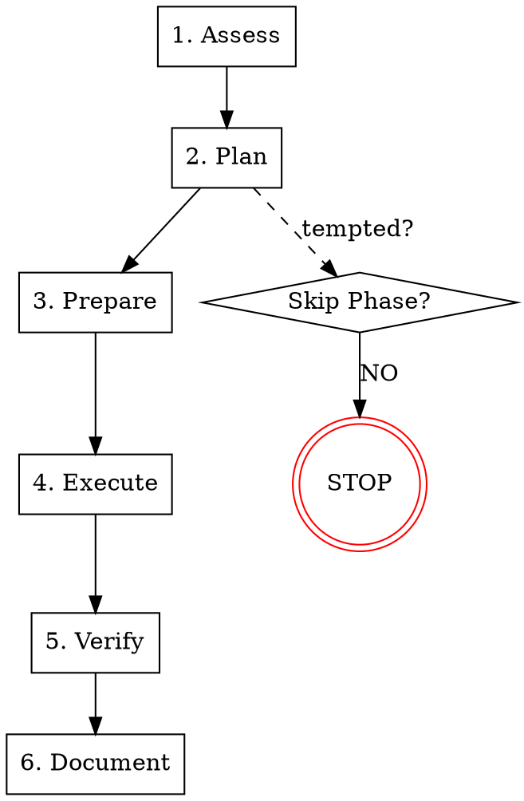

# Database Migration

## Overview

Database migrations are high-risk operations that can cause data loss, service outages, and inconsistencies. Rushed migrations fail; systematic migrations succeed.

**Core principle:** ALWAYS have a tested rollback plan before executing any migration. No migration is too small for planning.

**Violating the letter of this process is violating the spirit of database migration safety.**

## First 5 Minutes Checklist (Emergency Migration)

**Use this when urgent schema change needed. Don't think, follow the list.**

| Minute | Action | Output |
|--------|--------|--------|
| 0-1 | Identify what needs to change and why | `change_classified` |
| 1-2 | Check if change is reversible | `rollback_possible` or `requires_planning` |
| 2-3 | Estimate rows affected and lock impact | `impact_assessed` |
| 3-4 | Create backup of affected tables | `backup_verified` |
| 4-5 | If >1M rows or DDL lock: STOP, use full process | `proceed` or `escalate` |

**After 5 minutes:** Proceed to Phase 2 (Plan) if safe, otherwise follow full process.

## The Iron Law

```
NO MIGRATION WITHOUT A TESTED ROLLBACK PLAN FIRST
```

If you haven't verified you can undo the change, you cannot execute the migration.

## When to Use

Use for ANY database change:
- Schema modifications (ADD/DROP/ALTER)
- Large data transformations
- Index creation or removal
- Foreign key changes
- Data type conversions
- Table splitting or merging

**Use this ESPECIALLY when:**
- Zero-downtime is required (production systems)
- Table has >1 million rows
- Change affects foreign key relationships
- Multiple tables need coordinated changes
- Rollback must preserve data

**Don't skip when:**
- "It's just adding a column" (NULL vs NOT NULL matters)
- "We're in a hurry" (rushed migrations cause outages)
- "It's a small table" (today's small table is tomorrow's large table)

## When NOT to Use

This skill is for **systematic database migrations**. Don't use it for:

- **Local development only** - Experiment freely in dev
- **Seed data insertion** - Use standard insert scripts
- **Query optimization** - Use systematic-debugging for investigation
- **New greenfield tables** - Simple CREATE TABLE is fine

**Key distinction:** This skill manages schema and data changes in systems with existing data. For new projects without data, standard migration tools suffice.

## The Six Phases

You MUST complete each phase before proceeding to the next.



### Phase 1: Assess

**Classify the migration:**

1. **Identify Migration Type**
   - Schema-only (DDL): ADD COLUMN, CREATE INDEX, etc.
   - Data-only (DML): UPDATE, INSERT, DELETE
   - Combined: Schema + data transformation
   - Destructive: DROP, TRUNCATE, type narrowing

2. **Measure Impact**
   - Count rows affected: `SELECT COUNT(*) FROM table`
   - Estimate lock duration
   - Check table size and index count
   - Identify peak traffic windows

3. **Classify Risk Level**

| Risk | Criteria | Approach |
|------|----------|----------|
| **Low** | <100K rows, additive only, nullable | Direct migration |
| **Medium** | 100K-10M rows, non-destructive | Batched migration |
| **High** | >10M rows, schema + data | Expand-Contract |
| **Critical** | Destructive, FK changes | Blue-Green or Shadow |

**Completion criteria:**
- [ ] `migration_type_identified` - DDL/DML/Combined/Destructive
- [ ] `risk_level_classified` - Low/Medium/High/Critical
- [ ] `impact_measured` - Row count, lock estimate

### Phase 2: Plan

**Design the migration strategy:**

See `expand-contract-patterns.md` for zero-downtime techniques.

1. **Choose Migration Pattern**

| Pattern | Use When | Downtime |
|---------|----------|----------|
| **Direct** | Low risk, off-peak | Brief |
| **Batched** | Medium risk, large tables | None |
| **Expand-Contract** | High risk, zero-downtime required | None |
| **Blue-Green** | Critical, full schema redesign | Switchover only |
| **Shadow Table** | Type changes, column renames | Cutover only |

1. **Design Rollback Strategy**

See `rollback-strategies.md` for detailed procedures.

| Change Type | Rollback Approach |
|-------------|-------------------|
| ADD COLUMN (nullable) | DROP COLUMN |
| ADD COLUMN (not null) | Restore from backup or dual-write |
| DROP COLUMN | Restore from backup (data loss!) |
| ADD INDEX | DROP INDEX |
| MODIFY TYPE (widening) | No action needed |
| MODIFY TYPE (narrowing) | Restore from backup |
| ADD FK | DROP FK |
| DROP FK | Re-add FK (verify data integrity) |

1. **Create Migration Script**
   - Include UP and DOWN methods
   - Add checkpoints for large migrations
   - Include progress logging

**Completion criteria:**
- [ ] `pattern_selected` - Migration pattern chosen
- [ ] `rollback_designed` - Rollback procedure documented
- [ ] `script_created` - Migration script with UP/DOWN

### Phase 3: Prepare

**Set up for safe execution:**

See `validation-procedures.md` for integrity checks.

1. **Create Backup**
   - Full table backup for destructive changes
   - Point-in-time backup for data migrations
   - Verify backup is restorable

2. **Set Up Monitoring**
   - Query for lock monitoring
   - Replication lag tracking
   - Error rate alerting
   - Progress tracking query

3. **Run Pre-Migration Validation**

```sql
-- Example validation queries
-- Verify row count
SELECT COUNT(*) as pre_count FROM target_table;

-- Verify data integrity
SELECT COUNT(*) as orphans
FROM child_table c
LEFT JOIN parent_table p ON c.parent_id = p.id
WHERE p.id IS NULL;

-- Verify constraints
SELECT constraint_name, constraint_type
FROM information_schema.table_constraints
WHERE table_name = 'target_table';
```

1. **Test Rollback**
   - Execute rollback in staging
   - Verify data is preserved
   - Measure rollback duration

**Completion criteria:**
- [ ] `backup_created` - Backup verified restorable
- [ ] `monitoring_active` - Dashboards and alerts ready
- [ ] `pre_validation_passed` - All integrity checks green
- [ ] `rollback_tested` - Rollback verified in staging

### Phase 4: Execute

**Run the migration:**

See `large-scale-migration.md` for batch processing.

1. **Announce Migration**
   - Notify stakeholders
   - Post in incident channel
   - Update status page if needed

2. **Execute with Monitoring**

For batched migrations:
```sql
-- Example batch processing
DO $$
DECLARE
    batch_size INT := 10000;
    total_rows INT;
    processed INT := 0;
BEGIN
    SELECT COUNT(*) INTO total_rows FROM target_table WHERE condition;

    WHILE processed < total_rows LOOP
        UPDATE target_table
        SET new_column = transform(old_column)
        WHERE id IN (
            SELECT id FROM target_table
            WHERE condition AND new_column IS NULL
            LIMIT batch_size
        );

        processed := processed + batch_size;
        RAISE NOTICE 'Processed % of % rows', processed, total_rows;

        -- Brief pause to reduce lock contention
        PERFORM pg_sleep(0.1);
    END LOOP;
END $$;
```

1. **Monitor During Execution**
   - Watch replication lag
   - Monitor lock waits
   - Track error rates
   - Check application health

2. **Abort Criteria**
   - Replication lag > 30 seconds
   - Lock wait > 60 seconds
   - Error rate spike > 5%
   - Application errors increasing

**Completion criteria:**
- [ ] `migration_executed` - All changes applied
- [ ] `no_abort_triggered` - Execution completed without abort
- [ ] `stakeholders_notified` - Team informed of completion

### Phase 5: Verify

**Confirm migration success:**

1. **Run Post-Migration Validation**

```sql
-- Verify row count matches expectation
SELECT COUNT(*) as post_count FROM target_table;

-- Verify data transformation
SELECT COUNT(*) as failed_transforms
FROM target_table
WHERE new_column IS NULL AND old_column IS NOT NULL;

-- Verify referential integrity
SELECT COUNT(*) as broken_refs
FROM child_table c
LEFT JOIN parent_table p ON c.parent_id = p.id
WHERE p.id IS NULL;
```

1. **Application Health Check**
   - Run smoke tests
   - Verify critical paths work
   - Check error rates normalized

2. **Compare Pre/Post Metrics**
   - Row counts match expectations
   - Query performance acceptable
   - No data loss detected

**Completion criteria:**
- [ ] `post_validation_passed` - All integrity checks green
- [ ] `application_healthy` - Critical paths working
- [ ] `metrics_verified` - Pre/post comparison acceptable

### Phase 6: Document

**The migration is NOT complete until documented:**

1. **Update Changelog**
   - Note the migration
   - Document any data transformations
   - Record rollback procedure used

2. **Update Schema Documentation**
   - Update ERD if applicable
   - Update data dictionary
   - Note any deprecated columns

3. **Close Migration Ticket**
   - Link to monitoring during execution
   - Document any issues encountered
   - Record actual vs estimated duration

4. **Schedule Cleanup (if needed)**
   - For Expand-Contract: Plan contraction phase
   - For Shadow Table: Plan old table removal
   - Set reminder for cleanup deadline

**Completion criteria:**
- [ ] `changelog_updated` - Migration documented
- [ ] `schema_docs_updated` - Documentation current
- [ ] `ticket_closed` - Migration ticket resolved
- [ ] `cleanup_scheduled` - Follow-up tasks created

## Red Flags - STOP and Follow Process

If you catch yourself thinking:
- "Just run the migration, we can fix issues later"
- "It's only adding a column, no need to plan"
- "We don't have time for a rollback plan"
- "The table is small enough, skip batching"
- "We can restore from backup if needed" (without testing)
- "The migration ran fine in staging"
- "Let's do it during low traffic, should be fine"
- "Skip validation, we trust the transformation"

**ALL of these mean: STOP. Return to Phase 2.**

## Common Rationalizations

| Excuse | Reality |
|--------|---------|
| "It's just a nullable column" | Nullable columns become NOT NULL. Plan for it. |
| "Table has only 100K rows" | Tables grow. Build habits for when it's 100M. |
| "Staging worked fine" | Production has different data, scale, and traffic patterns. |
| "We can restore from backup" | Backup restore = downtime. Test it, measure it. |
| "It's off-peak hours" | Off-peak is when batch jobs run. Verify traffic patterns. |
| "Migration tool handles rollback" | Tools generate rollback, not verify it. Test manually. |
| "We've done this before" | Past success doesn't guarantee future success. Follow process. |
| "Business is pressuring us" | Outages cost more than delays. Process protects everyone. |

## Quick Reference

| Phase | Key Activities | Verification Key |
|-------|---------------|------------------|
| **1. Assess** | Type, impact, risk level | `risk_level_classified` |
| **2. Plan** | Pattern, rollback, script | `rollback_designed` |
| **3. Prepare** | Backup, monitoring, test rollback | `rollback_tested` |
| **4. Execute** | Announce, batch, monitor | `migration_executed` |
| **5. Verify** | Validation, health, metrics | `post_validation_passed` |
| **6. Document** | Changelog, schema docs, cleanup | `ticket_closed` |

## Risk-Based Response Times

| Risk Level | Max Duration | Rollback Window | Required Approvals |
|------------|--------------|-----------------|-------------------|
| **Low** | 1 hour | 24 hours | 1 reviewer |
| **Medium** | 4 hours | 72 hours | 2 reviewers |
| **High** | 1 day | 1 week | Tech lead + DBA |
| **Critical** | 1 week | 2 weeks | Architecture review |

## CI/CD Integration

Database migrations require careful coordination with deployment pipelines.

### Environment Progression

**Always progress: Dev → Staging → Production**

| Environment | Purpose | Migration Timing | Approval |
|-------------|---------|------------------|----------|
| **Dev** | Experiment freely | On commit | None |
| **Staging** | Verify with prod-like data | Pre-deploy | Auto |
| **Production** | Real execution | During deploy window | Manual |

**Key principle:** Migrations that pass staging with production-like data volume succeed in production.

### Pipeline Integration Patterns

**1. Pre-Deploy Migration (Recommended)**

```yaml
# CI/CD pipeline example
stages:
  - test
  - migrate-staging
  - validate-staging
  - approve-production
  - migrate-production
  - deploy-application
  - validate-production

migrate-production:
  script:
    - ./run-migration.sh --env production
    - ./validate-migration.sh --env production
  when: manual  # Require explicit approval
  allow_failure: false
```

**2. Application-Driven Migration (ORM Tools)**

```yaml
# For ORM-managed migrations (Prisma, TypeORM, Django, Rails)
deploy-production:
  script:
    # Backup before ORM migration
    - ./backup-database.sh
    # Run ORM migration with timeout
    - timeout 30m npx prisma migrate deploy
    # Validate after migration
    - ./validate-schema.sh
  on_failure:
    - ./alert-oncall.sh "Migration failed"
```

### ORM Migration Tool Guidelines

| Tool | Migration Command | Rollback Command | Notes |
|------|-------------------|------------------|-------|
| **Prisma** | `prisma migrate deploy` | Manual or `prisma migrate reset` | No auto-rollback in prod |
| **TypeORM** | `typeorm migration:run` | `typeorm migration:revert` | Revert runs DOWN method |
| **Django** | `python manage.py migrate` | `python manage.py migrate app 00XX` | Specify target migration |
| **Rails** | `rails db:migrate` | `rails db:rollback STEP=1` | STEP controls rollback depth |
| **Flyway** | `flyway migrate` | `flyway undo` (Teams only) | Undo requires paid version |
| **Liquibase** | `liquibase update` | `liquibase rollback` | Requires rollback tags |

**ORM Best Practices:**
- Always generate DOWN migration even if ORM doesn't require it
- Test ORM-generated SQL before production (use `--dry-run` or `--preview`)
- Set migration timeout (ORM defaults are often too generous)
- Capture migration output for audit trail

### Deployment Window Coordination


**Checklist for deployment windows:**
- [ ] Stakeholders notified 24h in advance
- [ ] On-call DBA available during window
- [ ] Rollback script tested and ready
- [ ] Monitoring dashboards open
- [ ] Status page updated to "Maintenance"

### Environment-Specific Configuration

```yaml
# Example: environment-specific migration config
migration:
  dev:
    batch_size: 50000       # Faster iteration
    pause_between: 10ms
    timeout: 10m
    require_rollback_test: false

  staging:
    batch_size: 10000       # Match production settings
    pause_between: 100ms
    timeout: 30m
    require_rollback_test: true

  production:
    batch_size: 5000        # Conservative
    pause_between: 200ms
    timeout: 60m
    require_rollback_test: true
    require_manual_approval: true
```

## Supporting Files

These files provide detailed guidance for specific phases:

- **`expand-contract-patterns.md`** - Zero-downtime migration techniques
- **`large-scale-migration.md`** - Batch processing, lock minimization, progress tracking
- **`rollback-strategies.md`** - Rollback procedures by migration type
- **`validation-procedures.md`** - Pre and post-migration integrity checks

## Related Skills

- **superpowers:systematic-debugging** - For diagnosing migration failures
- **superpowers:incident-response** - If migration causes production incident
- **superpowers:test-driven-development** - For testing data transformations

## Related Agents

- **data-engineer** - For schema design and query optimization context
- **migration-specialist** - For legacy system modernization context

## Real-World Impact

From database migration data:
- Systematic migrations: 98% success rate, avg 2 hours total
- Ad-hoc migrations: 70% success rate, avg 8 hours (including rollbacks)
- Pre-tested rollback: 95% successful recovery in <15 minutes
- Untested rollback: 40% require restore from backup (hours of downtime)
