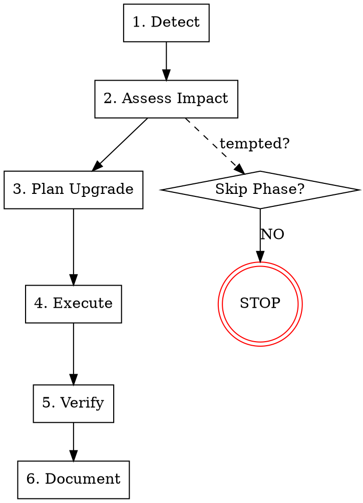

# Dependency Management

## Overview

Dependencies rot silently. Unmanaged packages become security liabilities, compatibility nightmares, and legal risks.

**Core principle:** ALWAYS assess, prioritize, and plan before updating. Rushed upgrades break production; ignored vulnerabilities enable breaches.

**Violating the letter of this process is violating the spirit of dependency management.**

## First 5 Minutes Checklist (Security Vulnerability)

**Use this when CVE alert arrives. Don't think, follow the list.**

| Minute | Action | Output |
|--------|--------|--------|
| 0-1 | Identify affected package and version | `package@version` confirmed |
| 1-2 | Check CVE severity (CVSS score) | Severity (Critical/High/Medium/Low) |
| 2-3 | Verify if your app is affected | `affected` or `not_affected` |
| 3-4 | Check if patch available | `patch_available` or `no_patch` |
| 4-5 | If Critical/High: Create incident ticket | Stakeholders aware |

**After 5 minutes:** Proceed to Phase 2 (Assess Impact) - you've completed Detect.

## The Iron Law

```
NO UPGRADES WITHOUT IMPACT ASSESSMENT FIRST
```

If you haven't assessed breaking changes and tested compatibility, you cannot merge dependency updates.

## When to Use

Use for ANY dependency management task:
- Security vulnerability (CVE) response
- Major version upgrades
- Lock file merge conflicts
- License compliance audits
- Dependency health reviews
- Outdated package remediation

**Use this ESPECIALLY when:**
- Critical CVE discovered (pressure to "just update")
- Major version jump required (2.x to 3.x)
- Multiple conflicting lock file changes
- Preparing for compliance audit
- Inheriting legacy project with outdated deps

**Don't skip when:**
- "It's just a patch version" (patches can break too)
- "We're in a hurry" (systematic is faster than hotfix loops)
- "Everyone else uses this version" (your context differs)

## When NOT to Use

This skill is for **systematic dependency management**. Don't use it for:

- **Adding new dependencies** - Evaluate need first, then use normal PR process
- **Development-only tools** - devDependencies with no prod impact
- **Automatic security patches** - Dependabot/Renovate auto-merge for patch versions
- **Learning/prototyping** - Experimental projects without production constraints

**Key distinction:** This skill manages systematic upgrade and security response. For simple package additions, use standard code review.

## The Six Phases

You MUST complete each phase before proceeding to the next.



### Phase 1: Detect

**Identify the dependency issue:**

1. **For Security Vulnerabilities:**
   - Run `npm audit` / `yarn audit` / `pnpm audit`
   - Check CVE databases (NVD, GitHub Advisory)
   - Note CVSS score and attack vector
   - Identify affected versions

2. **For Outdated Packages:**
   - Run `npm outdated` / `yarn outdated`
   - Identify major version gaps
   - Check changelog for breaking changes
   - Note last update date (maintenance status)

3. **For License Issues:**
   - Run license audit tool
   - Identify copyleft licenses (GPL, AGPL)
   - Check commercial restrictions
   - Note transitive dependencies

**Completion criteria:**
- [ ] `issue_identified` - Package, version, and issue type documented
- [ ] `severity_classified` - Critical/High/Medium/Low assigned

### Phase 2: Assess Impact

**Understand the blast radius BEFORE planning:**

See `security-vulnerability-response.md` for CVE-specific assessment.

1. **Usage Analysis**
   - Where is this package used in codebase?
   - How many files/modules import it?
   - Is it in critical path?

2. **Breaking Change Analysis**
   - Read CHANGELOG completely
   - Identify API changes
   - Check migration guide if available
   - List incompatible changes

3. **Dependency Chain**
   - What depends on this package?
   - Are there peer dependency conflicts?
   - Will upgrading cascade to other packages?

4. **Risk Assessment**
   - Business impact if upgrade fails?
   - Rollback complexity?
   - Testing coverage for affected areas?

**Completion criteria:**
- [ ] `usage_mapped` - All import locations identified
- [ ] `breaking_changes_listed` - API changes documented
- [ ] `risk_assessed` - Impact level determined

### Phase 3: Plan Upgrade

**Design the upgrade strategy:**

See `major-upgrade-guide.md` for staged upgrade patterns.

1. **Choose Upgrade Path**
   - Direct upgrade (minor/patch)
   - Staged upgrade (major versions)
   - Alternative package (if unmaintained)

2. **For Major Upgrades:**
   - Plan intermediate versions if needed
   - Identify code changes required
   - Estimate effort per change

3. **For Security Patches:**
   - Check if patch version available
   - If not, evaluate workarounds
   - Consider temporary mitigations

4. **Create Upgrade Ticket**
   - Document the plan
   - Assign owner
   - Set timeline based on severity

**Completion criteria:**
- [ ] `upgrade_path_defined` - Strategy documented
- [ ] `changes_estimated` - Code modifications listed
- [ ] `timeline_set` - Deadline based on severity

### Phase 4: Execute

**Implement the upgrade:**

See `lock-file-management.md` for conflict resolution.

1. **Create Feature Branch**
   - Branch from main
   - Clear naming: `deps/upgrade-package-v3`

2. **Update Package**
   - Update package.json
   - Run install to update lock file
   - Commit lock file changes separately

3. **Make Required Code Changes**
   - Apply API changes
   - Update deprecated usages
   - Add any new configurations

4. **Run Tests**
   - Full test suite
   - Manual testing for critical paths
   - Integration tests if applicable

**Completion criteria:**
- [ ] `package_updated` - Version bumped in package.json
- [ ] `lock_file_clean` - No merge conflicts
- [ ] `tests_passing` - All tests green

### Phase 5: Verify

**Confirm the upgrade works:**

1. **Build Verification**
   - Production build succeeds
   - No new warnings
   - Bundle size acceptable

2. **Runtime Verification**
   - Application starts
   - Critical paths work
   - No console errors

3. **Security Verification (if CVE)**
   - Re-run audit tool
   - Vulnerability resolved
   - No new vulnerabilities introduced

**Completion criteria:**
- [ ] `build_verified` - Production build succeeds
- [ ] `runtime_verified` - Application works correctly
- [ ] `security_verified` - Audit passes (if CVE)

### Phase 6: Document

**The upgrade is NOT complete until documented:**

1. **Update Changelog**
   - Note the upgrade
   - List any breaking changes handled
   - Reference CVE if security-related

2. **Update Documentation**
   - Update any version-specific docs
   - Note configuration changes
   - Update README if relevant

3. **Close Tickets**
   - Link PR to issue
   - Close vulnerability ticket
   - Update audit tracking

**Completion criteria:**
- [ ] `changelog_updated` - Upgrade documented
- [ ] `ticket_closed` - Issue resolved and linked

## Red Flags - STOP and Follow Process

If you catch yourself thinking:
- "Just bump the version and see if it works"
- "It's only a patch, won't break anything"
- "We'll fix breaking changes as we find them"
- "Skip the audit, we need this deployed"
- "License doesn't matter for internal tools"
- "Lock file conflicts are fine to auto-resolve"
- "Dependabot will handle security"
- "We can deal with deprecation warnings later"

**ALL of these mean: STOP. Return to Phase 2.**

## Common Rationalizations

| Excuse | Reality |
|--------|---------|
| "It's just a patch version" | Patch versions can contain breaking changes. Semantic versioning is a promise, not a guarantee. |
| "We're behind, need to catch up" | Rushed upgrades cause production incidents. Systematic upgrades are faster long-term. |
| "Everyone else uses this version" | Your codebase has unique usage patterns. Test YOUR code. |
| "Lock file changes are noise" | Lock file integrity prevents "works on my machine." Treat it as source code. |
| "License is fine, it's open source" | Open source has obligations. GPL can require code disclosure. Check ALWAYS. |
| "CVE doesn't affect us" | Verify with evidence, don't assume. Attack vectors are creative. |
| "We'll handle deprecations later" | Deprecation warnings become errors. Address when upgrading. |
| "Auto-merge is safe for patches" | Auto-merge is safe for MONITORED patches. Set up failure alerts. |

## Quick Reference

| Phase | Key Activities | Verification Key |
|-------|---------------|------------------|
| **1. Detect** | Audit, identify, classify severity | `issue_identified` |
| **2. Assess** | Usage mapping, breaking changes, risk | `risk_assessed` |
| **3. Plan** | Upgrade path, code changes, timeline | `upgrade_path_defined` |
| **4. Execute** | Branch, update, test | `tests_passing` |
| **5. Verify** | Build, runtime, security audit | `build_verified` |
| **6. Document** | Changelog, docs, close tickets | `ticket_closed` |

## Severity Response Times

| Severity | CVSS Score | Response Time | Action |
|----------|------------|---------------|--------|
| **Critical** | 9.0-10.0 | 24 hours | Immediate patch or mitigation |
| **High** | 7.0-8.9 | 7 days | Prioritized upgrade |
| **Medium** | 4.0-6.9 | 30 days | Scheduled upgrade |
| **Low** | 0.1-3.9 | 90 days | Next maintenance cycle |

## Monorepo Considerations

When managing dependencies in monorepos (multiple package.json files):

### Workspace Tools

| Tool | Command | Purpose |
|------|---------|---------|
| npm workspaces | `npm audit --workspaces` | Audit all workspaces |
| Yarn workspaces | `yarn workspaces foreach npm audit` | Audit each workspace |
| pnpm | `pnpm -r audit` | Recursive audit |
| Lerna | `lerna exec -- npm audit` | Execute in each package |
| Turborepo | `turbo run audit` | Run audit task |
| Nx | `nx run-many --target=audit` | Parallel audit |

### Monorepo-Specific Workflow

1. **Detect (Modified)**
   - Audit ALL packages: `npm audit --workspaces`
   - Check shared dependencies in root
   - Identify which packages are affected

2. **Assess Impact (Critical)**
   - Map internal package dependencies
   - Check if upgrade affects shared packages
   - Consider publish order for internal packages

3. **Execute (Coordinated)**
   - Update root and workspace packages together
   - Use `--workspace=<name>` for targeted updates
   - Regenerate root lock file after all changes

### Shared vs Package-Specific Dependencies

| Location | Use For | Example |
|----------|---------|---------|
| Root `package.json` | Shared tooling, workspace-wide deps | TypeScript, ESLint, build tools |
| Package `package.json` | Package-specific runtime deps | React (if only some packages need it) |

### Version Synchronization

```bash
# Ensure consistent versions across workspaces
npx syncpack list-mismatches
npx syncpack fix-mismatches
```

### CI Considerations

- Run audit in each workspace
- Verify all lock files are in sync
- Test affected packages after dependency changes

## Supporting Files

These files provide detailed guidance for specific phases:

- **`security-vulnerability-response.md`** - CVE severity handling, patch assessment, temporary mitigations
- **`major-upgrade-guide.md`** - Breaking change analysis, staged upgrades, compatibility testing
- **`lock-file-management.md`** - Merge conflict resolution, CI validation, automation
- **`license-compliance.md`** - License obligations, compatibility matrices, audit procedures

## Related Skills

- **superpowers:systematic-debugging** - For diagnosing upgrade-related failures
- **superpowers:test-driven-development** - For adding tests before risky upgrades
- **superpowers:incident-response** - If security upgrade causes production incident

## Real-World Impact

From dependency management data:
- Systematic upgrades: 95% success rate, avg 30 min per package
- Ad-hoc upgrades: 60% success rate, avg 2 hours debugging
- CVE response with process: 4 hour average resolution
- CVE response without process: 48+ hour average resolution
- License audit findings: 70% caught by automated tooling
