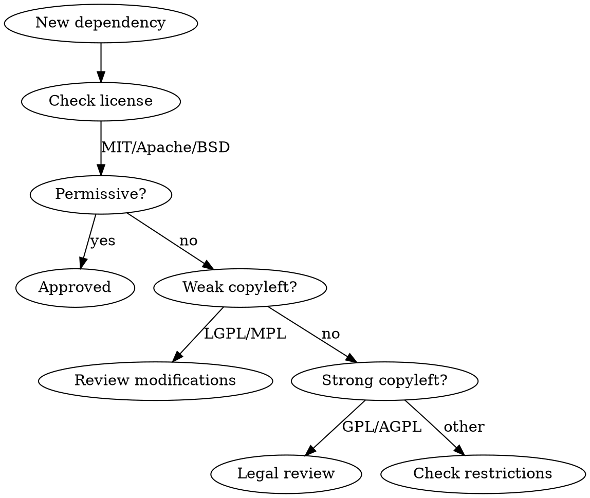

# License Compliance

Guide to open-source license obligations and compliance procedures.

## Why License Compliance Matters

- **Legal risk:** License violations can result in lawsuits
- **Copyleft exposure:** GPL can require source disclosure
- **Commercial restrictions:** Some licenses prohibit commercial use
- **Attribution requirements:** Many licenses require credits

**Ignorance is not a defense.** Every dependency introduces license obligations.

## License Categories

### Permissive Licenses

Low risk, minimal obligations:

| License | Attribution | Modification | Commercial | Copyleft |
|---------|-------------|--------------|------------|----------|
| MIT | Required | Allowed | Allowed | No |
| Apache 2.0 | Required | Allowed | Allowed | No |
| BSD-2 | Required | Allowed | Allowed | No |
| BSD-3 | Required | Allowed | Allowed | No |
| ISC | Required | Allowed | Allowed | No |

**Safe for:** Most projects, including commercial and proprietary

### Weak Copyleft

Medium risk, modifications must be shared:

| License | Attribution | Modification | Commercial | Copyleft |
|---------|-------------|--------------|------------|----------|
| LGPL-2.1 | Required | Share changes | Allowed | Library only |
| LGPL-3.0 | Required | Share changes | Allowed | Library only |
| MPL-2.0 | Required | Share changes | Allowed | File-level |

**Safe for:** Using as library, NOT modifying
**Requires attention:** If you modify the library code

### Strong Copyleft

High risk, entire project may need to be open:

| License | Attribution | Modification | Commercial | Copyleft |
|---------|-------------|--------------|------------|----------|
| GPL-2.0 | Required | Share all | Allowed* | Full project |
| GPL-3.0 | Required | Share all | Allowed* | Full project |
| AGPL-3.0 | Required | Share all | Allowed* | Network use |

*Commercial allowed, but must open source entire work

**Warning:** Including GPL code in proprietary software may require open-sourcing your entire project.

### Restrictive/Proprietary

High risk, limited or no use rights:

| License | Risk Level | Typical Restrictions |
|---------|------------|----------------------|
| SSPL | Very High | Network use requires full stack disclosure |
| BSL | High | Production use may require commercial license |
| Proprietary | Varies | Check specific terms |

## License Compatibility Matrix

Can these licenses coexist in the same project?

| Base License | MIT | Apache | LGPL | GPL | AGPL |
|--------------|-----|--------|------|-----|------|
| **MIT** | Yes | Yes | Yes | Yes* | Yes* |
| **Apache 2.0** | Yes | Yes | Yes | No** | No |
| **LGPL** | Yes | Yes | Yes | Yes | Yes |
| **GPL** | Yes* | No** | Yes | Yes | Yes |
| **AGPL** | Yes* | No | Yes | Yes | Yes |

*Resulting work becomes GPL/AGPL
**Apache 2.0 is incompatible with GPL-2.0 (compatible with GPL-3.0)

## Audit Procedures

### Automated License Scanning

```bash
# Using license-checker (npm)
npx license-checker --summary

# Detailed report
npx license-checker --json > licenses.json

# Check for problematic licenses
npx license-checker --failOn "GPL;AGPL;SSPL"
```

### CI Integration

```yaml
# GitHub Actions
- name: License check
  run: |
    npx license-checker --failOn "GPL-3.0;AGPL-3.0;SSPL" --excludePrivatePackages
```

### Quarterly Audit Checklist

- [ ] Run license scanner on all projects
- [ ] Review any new licenses added
- [ ] Verify attribution files are current
- [ ] Check for license changes in updated packages
- [ ] Review transitive dependencies
- [ ] Document any approved exceptions

## Attribution Requirements

### NOTICE File

Create and maintain `NOTICE` or `THIRD_PARTY_LICENSES`:

```markdown
# Third-Party Licenses

This software includes the following third-party components:

## lodash
- License: MIT
- Copyright (c) JS Foundation and other contributors
- https://github.com/lodash/lodash/blob/master/LICENSE

## axios
- License: MIT
- Copyright (c) 2014-present Matt Zabriskie
- https://github.com/axios/axios/blob/master/LICENSE
```

### Automated Attribution Generation

```bash
# Generate license report
npx license-checker --customPath customFormat.json --out THIRD_PARTY_LICENSES.md
```

## Handling Problematic Licenses

### GPL in JavaScript/Node.js

**Common misconception:** "GPL doesn't apply to npm packages"

**Reality:** If your code imports/requires GPL code, your code may become GPL.

**Mitigation options:**
1. Find MIT/Apache alternative
2. Use as separate service (not linked)
3. Get commercial license from author
4. Open source your project

### AGPL Implications

AGPL extends GPL to network use. If your AGPL-licensed code runs on a server, users can request source code.

**Implications:**
- SaaS using AGPL must provide source
- Internal tools may be exempt
- Check with legal for specific cases

### License Change After Adoption

If a dependency changes license:
1. You can continue using the old version (old license applies)
2. New versions require new license compliance
3. Document the version/license you're using

## Compliance Workflow

### New Dependency Check

Before adding any dependency:

```bash
# Check license
npm view <package> license

# Check for problematic transitive deps
npx license-checker --production --packages <package>
```

Decision tree:



### Approval Workflow

For non-permissive licenses:

1. **Document the request**
   - Package name and version
   - License type
   - Business justification

2. **Legal/compliance review**
   - Impact assessment
   - Alternative evaluation
   - Risk acceptance

3. **Approval tracking**
   - Record approval in decision log
   - Add to approved exceptions list
   - Set review date

## Exception Tracking

### Approved Exceptions Log

```markdown
# License Exceptions

| Package | License | Approved By | Date | Reason | Review Date |
|---------|---------|-------------|------|--------|-------------|
| example-pkg | LGPL-2.1 | Legal Team | 2024-01-15 | No modification needed | 2025-01-15 |
```

### Exception Review Triggers

Review exceptions when:
- Package is updated
- Package license changes
- Usage pattern changes
- Compliance audit scheduled

## Tools and Resources

### License Scanning Tools

| Tool | Free Tier | CI Integration | Transitive Deps |
|------|-----------|----------------|-----------------|
| license-checker | Yes | Yes | Yes |
| FOSSA | Yes | Yes | Yes |
| Snyk | Yes | Yes | Yes |
| WhiteSource | No | Yes | Yes |

### License Databases

- [SPDX License List](https://spdx.org/licenses/) - Standard identifiers
- [choosealicense.com](https://choosealicense.com/) - Plain language summaries
- [TLDRLegal](https://tldrlegal.com/) - License explanations

### Legal Resources

- Open Source Initiative (OSI) - Official license definitions
- Software Freedom Conservancy - GPL compliance guidance
- Linux Foundation - Open source legal resources

## Emergency Procedures

### License Violation Discovered

1. **Stop distribution** - Don't deploy updates with violation
2. **Document scope** - What's affected, how long, where
3. **Legal consultation** - Get professional advice
4. **Remediation plan** - Remove, replace, or comply
5. **Communication** - If public exposure, prepare response

### GPL Compliance Request

If someone requests source under GPL:

1. Verify the claim (is GPL code actually included?)
2. Prepare the source code
3. Provide within reasonable time (30 days typical)
4. Review how to prevent future issues
