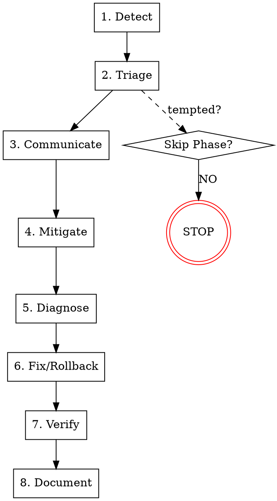

# Incident Response

## Overview

Incidents demand disciplined response, not heroic fixes. Rushed patches mask problems and create new ones.

**Core principle:** ALWAYS triage, communicate, and contain before attempting fixes. Technical investigation follows organizational response.

**Violating the letter of this process is violating the spirit of incident response.**

## First 5 Minutes Checklist

**Use this when alerts fire. Don't think, follow the list.**

| Minute | Action | Output |
|--------|--------|--------|
| 0-1 | Acknowledge alert | `incident_acknowledged` |
| 1-2 | Screenshot dashboards NOW | Evidence preserved |
| 2-3 | Assess: >50% users? Critical function? | Severity (P1-P4) |
| 3-4 | Post in incident channel: severity + impact + trace_id | `stakeholders_notified` |
| 4-5 | If P1/P2: Open war room, page on-call | Responders engaged |

**After 5 minutes:** Proceed to Phase 4 (Mitigate) - you've completed Detect, Triage, Communicate.

## The Iron Law

```
NO FIXES WITHOUT TRIAGE AND COMMUNICATION FIRST
```

If you haven't classified severity and notified stakeholders, you cannot propose fixes.

## When to Use

Use for ANY production incident:
- Alerts firing (P1-P4)
- Customer reports of issues
- Monitoring anomalies
- Service degradation
- Security incidents
- Data integrity concerns

**Use this ESPECIALLY when:**
- Under time pressure (emergencies make shortcuts tempting)
- Multiple systems failing (panic causes scattered responses)
- "Just fix it" pressure from stakeholders
- You don't fully understand the scope yet
- Previous fix attempt didn't work

**Don't skip when:**
- Issue seems simple (simple incidents have complex causes too)
- You're in a hurry (systematic response is faster than thrashing)
- Management wants it fixed NOW (protocol prevents extended outages)

## When NOT to Use

This skill is for **organizational incident response**. Don't use it for:

- **Local development issues** - Your build failing isn't an incident
- **Non-production environments** - Staging bugs use normal debugging
- **Planned maintenance** - Scheduled changes have different protocols
- **Feature bugs with no urgency** - Normal backlog items, not incidents
- **Performance optimization** - Use systematic-debugging for investigation
- **One-off user reports** - Investigate first; escalate to incident if widespread

**Key distinction:** This skill manages the organizational response (communication, escalation, coordination). For technical root cause analysis, hand off to `superpowers:systematic-debugging` at Phase 5.

## The Eight Phases

You MUST complete each phase before proceeding to the next.



### Phase 1: Detect

**Acknowledge the incident:**

1. **Confirm the alert is valid**
   - Not a false positive?
   - Reproducible?
   - Multiple signals confirming?

2. **Capture initial evidence**
   - Screenshot dashboards NOW (before they scroll)
   - Note the exact time
   - Record the alert message verbatim
   - Preserve trace_id if available

3. **Declare incident start**
   - "Incident acknowledged at [TIME]"
   - Assign incident_id if your system has one

**Completion criteria:**
- [ ] `incident_acknowledged` - Alert confirmed and logged

### Phase 2: Triage

**Classify severity BEFORE taking action:**

See `severity-classification.md` for detailed criteria.

1. **Assess impact scope**
   - How many users affected?
   - Which features/services impacted?
   - What's the blast radius?

2. **Classify severity (P1-P4)**
   - P1: >50% users, critical function down
   - P2: 10-50% users, major feature unavailable
   - P3: <10% users, workaround exists
   - P4: Minimal impact, no urgency

3. **Determine business impact**
   - Revenue at risk?
   - Compliance implications?
   - Reputation damage?

4. **Check SLO status**
   - Which SLO is breaching?
   - What's the error budget burn rate?
   - How fast are we consuming budget?

**Completion criteria:**
- [ ] `severity_classified` - P1/P2/P3/P4 assigned
- [ ] `impact_assessed` - Users affected and scope documented

### Phase 3: Communicate

**Notify stakeholders BEFORE attempting fixes:**

See `communication-templates.md` for notification formats.

1. **Internal notification**
   - Alert the on-call team
   - Notify relevant stakeholders
   - Open incident channel/war room (P1/P2)

2. **External communication (if applicable)**
   - Update status page
   - Prepare customer communication
   - Follow regulatory requirements

3. **Set communication cadence**
   - P1: Updates every 15 minutes
   - P2: Updates every 30 minutes
   - P3/P4: Updates at milestones

4. **Include trace_id in all communications**
   - Enables instant context jumping
   - Links logs, traces, and metrics

**Completion criteria:**
- [ ] `stakeholders_notified` - Team/leadership informed
- [ ] `communication_cadence_set` - Update schedule established

### Phase 4: Mitigate

**Contain the blast radius:**

1. **Evaluate rollback FIRST**
   - Was there a recent deployment?
   - Can we rollback safely?
   - Rollback is often faster than forward-fix

2. **If rollback not viable:**
   - Can we disable the failing feature?
   - Can we route traffic away?
   - Can we scale resources?

3. **Preserve evidence before action**
   - Export logs before rotation
   - Capture heap/thread dumps
   - Screenshot metrics dashboards

4. **Implement containment**
   - Apply the chosen mitigation
   - Verify it's working
   - Communicate the mitigation status

**Completion criteria:**
- [ ] `rollback_evaluated` - Rollback option assessed
- [ ] `containment_verified` - Blast radius limited
- [ ] `evidence_preserved` - Logs/traces captured before action

### Phase 5: Diagnose

**Now investigate the root cause:**

**HANDOFF:** Use `superpowers:systematic-debugging` for technical investigation.

1. **Form hypothesis**
   - What changed recently?
   - What do the logs/traces show?
   - Which component is failing?

2. **Test hypothesis**
   - One variable at a time
   - Gather evidence, don't guess
   - Follow the systematic debugging phases

3. **If 3+ hypotheses failed:**
   - STOP and question architecture
   - Escalate for fresh perspective
   - Don't keep guessing

**Completion criteria:**
- [ ] `root_cause_identified` - Cause confirmed with evidence
- [ ] OR `escalated_for_help` - Fresh eyes requested after 3+ failed hypotheses

### Phase 6: Fix or Rollback

**Apply the resolution:**

1. **If rollback is the answer:**
   - Execute rollback procedure
   - Verify rollback completed
   - Confirm service restored

2. **If forward-fix required:**
   - Implement minimal fix
   - Get peer review (even quick)
   - Stage the fix properly

3. **Never skip verification**
   - Test the fix works
   - Confirm no side effects
   - Don't just "hope it worked"

**Completion criteria:**
- [ ] `fix_deployed` - Forward fix applied and reviewed
- [ ] OR `rollback_completed` - Previous state restored

### Phase 7: Verify

**Confirm the incident is resolved:**

**HANDOFF:** Use `superpowers:verification-before-completion` for thorough verification.

1. **Service health check**
   - Error rates back to normal?
   - Latency within SLO?
   - No new alerts?

2. **User impact verification**
   - Can users complete flows?
   - Any lingering issues?
   - Customer reports resolved?

3. **Monitoring confirmation**
   - Dashboards showing green?
   - SLO back in budget?
   - No anomalies in metrics?

**Completion criteria:**
- [ ] `service_restored` - Users can complete flows normally
- [ ] `slo_compliant` - Error rates and latency within SLO

### Phase 8: Document

**The incident is NOT resolved until documentation exists:**

See `postmortem-template.md` for the blameless RCA framework.

1. **Schedule postmortem**
   - Within 48 hours for P1/P2
   - Within 1 week for P3/P4
   - Include all responders

2. **Capture timeline**
   - What happened, when, by whom
   - Use trace_id to reconstruct
   - Include communication history

3. **Identify action items**
   - Preventive measures
   - Detection improvements
   - Process enhancements

4. **Close the incident**
   - All stakeholders notified
   - Status page updated
   - Incident marked resolved

**Completion criteria:**
- [ ] `postmortem_scheduled` - Meeting booked within required window
- [ ] `incident_closed` - Stakeholders notified, status page updated

## Red Flags - STOP and Follow Process

If you catch yourself thinking:
- "Quick fix for now, investigate later"
- "Just try this and see if it works"
- "No time for communication, focus on fixing"
- "Skip the triage, obviously it's P1"
- "Rollback is too risky, let's push forward"
- "We can document later, let's close this"
- "I know what the problem is, trust me"
- "The user wants speed, not process"

**ALL of these mean: STOP. Return to the current phase.**

## Common Rationalizations

| Excuse | Reality |
|--------|---------|
| "This is obviously a P1" | Every incident feels urgent. Triage takes 2 minutes, wrong classification causes chaos. |
| "Fix first, communicate later" | Silent outages create panic. 30-second update prevents 30-minute escalation. |
| "Rollback is too risky" | Known state > uncertain forward fix. Rollback buys time to fix properly. |
| "We can investigate after fixing" | Evidence disappears after restart. Capture now, analyze later. |
| "It's a one-off, skip the postmortem" | All incidents feel unique. Patterns emerge only from documentation. |
| "I know this system, trust me" | Expert intuition fails under pressure. Protocol beats intuition. |
| "Communication slows us down" | Coordinated response > heroic solo effort. Communication accelerates resolution. |
| "Previous fix worked, try another" | 3+ fixes = wrong diagnosis. Stop guessing, investigate properly. |

## Quick Reference

| Phase | Key Activities | Verification Key |
|-------|---------------|------------------|
| **1. Detect** | Acknowledge, capture evidence, record time, **capture trace_id** | `incident_acknowledged` |
| **2. Triage** | Assess impact, classify P1-P4, check SLO | `severity_classified` |
| **3. Communicate** | Notify team, update status, set cadence, **include trace_id** | `stakeholders_notified` |
| **4. Mitigate** | Evaluate rollback, contain blast radius | `containment_verified` |
| **5. Diagnose** | Form hypothesis, test systematically | `root_cause_identified` |
| **6. Fix/Rollback** | Apply resolution, get review | `fix_deployed` |
| **7. Verify** | Confirm resolution, check SLO | `service_restored` |
| **8. Document** | Schedule postmortem, capture timeline, **correlate via trace_id** | `postmortem_scheduled` |

**🔑 trace_id:** Include in ALL internal communications - enables instant context jumping across logs, traces, and metrics.

## Supporting Files

These files provide detailed guidance for specific phases:

- **`severity-classification.md`** - P1-P4 criteria with SLO burn rate mapping
- **`communication-templates.md`** - Notification templates for stakeholders
- **`postmortem-template.md`** - Blameless RCA framework and action items
- **`escalation-matrix.md`** - Role-based escalation paths per severity

## Related Skills

- **superpowers:systematic-debugging** - For Phase 5 (Diagnose) root cause analysis
- **superpowers:verification-before-completion** - For Phase 7 (Verify) confirmation

## Real-World Impact

From incident response data:
- Systematic response: MTTR 30-60 minutes
- Ad-hoc heroics: MTTR 2-4 hours
- Communication during incident: 70% fewer escalations
- Postmortem completion: 50% fewer repeat incidents
