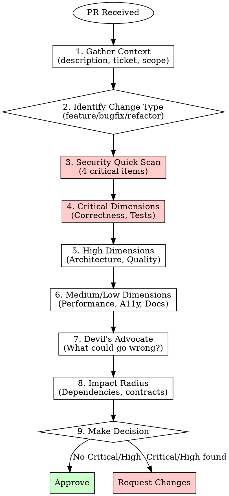

# PR Review

## Overview

Systematic, evidence-based pull request review with anti-sycophancy principles. Critique-first ordering ensures critical issues are identified before any positive observations.

**Core principle:** Review what changed, not what it's called. Labels lie. Tests verify author's assumptions—review catches flawed assumptions.

**Violating the letter of this process is violating the spirit of code review.**

## The Iron Law

```
NO APPROVAL WITHOUT COMPLETING ALL CRITICAL DIMENSIONS
```

Security, Correctness, and Test Coverage must ALWAYS be reviewed. No exceptions.

- Urgency doesn't reduce risk. Hotfix = MORE likely to introduce bugs.
- Trust is not a checklist substitute. Everyone makes mistakes.
- Tests passing ≠ logic correct. Tests verify author assumptions.

## Quick Reference

### Priority Levels

| Priority | Action | Dimensions |
|----------|--------|------------|
| **Critical** | Must complete ALWAYS | Correctness, Security, Tests |
| **High** | Must complete for non-trivial PRs | Architecture, Code Quality |
| **Medium** | Complete based on change type | Performance, Accessibility |
| **Low** | Complete if time permits | Documentation |

### Production Blockers (Auto-Reject)

| Issue | Why It Blocks |
|-------|---------------|
| Hardcoded secrets | Security vulnerability |
| SQL injection possible | Data breach risk |
| Missing auth on protected route | Unauthorized access |
| No tests for new code | Regression risk |
| Critical security issue | Production incident |

### Approval Decision Matrix

| Finding | Decision |
|---------|----------|
| Any Critical issue | **Request Changes** |
| Multiple High issues | **Request Changes** |
| Only Medium/Low issues | **Approve with Comments** |
| No issues, all Critical dimensions reviewed | **Approve** |

## When to Use

**Always use for:**
- New feature PRs
- Bug fix PRs
- Refactoring PRs
- Security-related changes
- API changes
- Database schema changes

**Lighter review acceptable for:**
- Documentation-only changes
- Configuration tweaks (still check security)
- Dependency updates (still check security + breaking changes)

**Never skip:**
- Security Quick Scan (4 critical items, ~2 min)

## Review Process



**Key:** Red boxes = mandatory, never skip.

## Review Dimensions

### Critical: Correctness & Logic

Does the code do what it claims to do?

| ID | Check | Priority |
|----|-------|----------|
| CR-001 | Logic matches stated requirements/ticket | Critical |
| CR-002 | Edge cases handled (null, empty, boundary) | Critical |
| CR-003 | Error conditions handled appropriately | Critical |
| CR-004 | Data transformations preserve all fields | High |
| CR-005 | Conditional branches cover all cases | High |
| CR-006 | Off-by-one errors checked in loops | High |
| CR-007 | Async operations await properly | High |
| CR-008 | State mutations intentional and controlled | Medium |

### Critical: Security

See **Security Quick Scan** section for 4 critical items (~2 min).

Full checklist for deeper review:

| ID | Check | Priority |
|----|-------|----------|
| SEC-001 | No hardcoded secrets/credentials | Critical |
| SEC-002 | SQL queries parameterized | Critical |
| SEC-003 | Auth required on protected routes | Critical |
| SEC-004 | Authorization verifies ownership | Critical |
| SEC-005 | XSS prevented (output encoding) | High |
| SEC-006 | CSRF tokens on state changes | High |
| SEC-007 | Sensitive data not logged | High |
| SEC-008 | File uploads validated | High |

### Critical: Test Coverage

| ID | Check | Priority |
|----|-------|----------|
| TEST-001 | New code has corresponding tests | Critical |
| TEST-002 | Tests verify behavior, not implementation | High |
| TEST-003 | Edge cases and error paths tested | High |
| TEST-004 | Tests are readable (clear names) | Medium |
| TEST-005 | No mocking of implementation details | Medium |
| TEST-006 | Coverage meets target (90%+ core) | High |
| TEST-007 | Tests run successfully (no flaky) | Critical |
| TEST-008 | Integration tests for cross-component | Medium |

### High: Architecture & Design

| ID | Check | Priority |
|----|-------|----------|
| ARCH-001 | Layer boundaries respected | High |
| ARCH-002 | Dependency direction correct | High |
| ARCH-003 | Single Responsibility followed | High |
| ARCH-004 | No premature abstraction (YAGNI) | Medium |
| ARCH-005 | Changes localized (not scattered) | Medium |
| ARCH-006 | Public APIs designed for stability | High |
| ARCH-007 | Appropriate patterns (not over-engineered) | Medium |
| ARCH-008 | Migration path for breaking changes | High |

### High: Code Quality

| ID | Check | Priority |
|----|-------|----------|
| CQ-001 | No code duplication (DRY) | High |
| CQ-002 | Functions small (10-20 lines) | Medium |
| CQ-003 | Cyclomatic complexity acceptable (<=10) | Medium |
| CQ-004 | Nesting depth reasonable (<=3) | Medium |
| CQ-005 | TypeScript types explicit (no `any`) | High |
| CQ-006 | Names meaningful and consistent | High |
| CQ-007 | Dead code removed | Medium |
| CQ-008 | Comments explain 'why' not 'what' | Low |

### Medium: Performance

| ID | Check | Priority |
|----|-------|----------|
| PERF-001 | No N+1 queries | High |
| PERF-002 | Expensive operations memoized | Medium |
| PERF-003 | Bundle size impact acceptable | Medium |
| PERF-004 | No blocking on main thread | High |
| PERF-005 | Large lists virtualized | Medium |
| PERF-006 | Images optimized | Low |
| PERF-007 | Caching strategy appropriate | Medium |
| PERF-008 | Memory leaks prevented | High |

### Medium: Accessibility

| ID | Check | Priority |
|----|-------|----------|
| A11Y-001 | Semantic HTML used | High |
| A11Y-002 | Keyboard accessible | High |
| A11Y-003 | Images have alt text | Medium |
| A11Y-004 | Form inputs have labels | High |
| A11Y-005 | Color not only indicator | Medium |
| A11Y-006 | Focus management correct | High |
| A11Y-007 | ARIA attributes correct | Medium |
| A11Y-008 | Screen reader verified | Medium |

### Low: Documentation

| ID | Check | Priority |
|----|-------|----------|
| DOC-001 | PR description explains 'why' | Medium |
| DOC-002 | Complex logic commented | Low |
| DOC-003 | Public APIs documented | Medium |
| DOC-004 | README updated if needed | Low |
| DOC-005 | Breaking changes documented | High |
| DOC-006 | Config changes documented | Medium |
| DOC-007 | Migration guide provided | Medium |
| DOC-008 | Commit messages clear | Low |

## Security Quick Scan

**Always run. Takes ~2 minutes. Catches 80% of critical security issues.**

| ID | Check | Detection Pattern |
|----|-------|-------------------|
| SEC-001 | No hardcoded secrets | Search: `password=`, `apiKey=`, `token=`, `secret=` |
| SEC-002 | SQL injection prevented | Look for string concatenation in queries |
| SEC-003 | Auth on protected routes | New routes have auth middleware |
| SEC-004 | Authorization checks | Resource access verifies ownership |

**If ANY fail → STOP. Request changes immediately.**

### Risk Signals (Trigger Deep Review)

- New/modified authentication code
- Database query changes
- User input handling changes
- File upload functionality
- External API integrations
- Cryptographic operations
- Permission/authorization changes
- New API endpoints

## Accessibility Quick Scan

**Run for UI changes. Takes ~2 minutes. Catches common A11Y barriers.**

| ID | Check | Detection Pattern |
|----|-------|-------------------|
| A11Y-001 | Semantic HTML used | Search: `<div onClick=`, `<span onClick=` (should be buttons) |
| A11Y-002 | Keyboard accessible | onClick handlers without onKeyDown/onKeyPress |
| A11Y-004 | Form inputs have labels | `<input>` without associated label or aria-label |
| A11Y-006 | Focus management correct | tabIndex manipulation, focus traps in modals |

**If ANY fail in user-facing UI → Request changes.**

### UI Change Signals (Trigger A11Y Review)

- New UI components or pages
- Modal/dialog implementations
- Form additions or changes
- Interactive element changes (buttons, links, menus)
- Navigation structure changes
- Custom widget implementations

## Devil's Advocate Analysis

**Mandatory section. Challenge the implementation.**

### Questions to Ask

1. **What could go wrong in production?**
   - Under high load?
   - With unexpected input?
   - With network failures?

2. **What assumptions might be wrong?**
   - Data format assumptions?
   - Timing assumptions?
   - State assumptions?

3. **What edge cases are unhandled?**
   - Empty collections?
   - Null/undefined values?
   - Concurrent modifications?
   - Partial failures?

4. **What happens when dependencies fail?**
   - External API down?
   - Database connection lost?
   - Cache miss?

## Impact Radius Analysis

### Direct Dependencies

| Question | How to Check |
|----------|--------------|
| What imports this file? | `grep -r "import.*from.*<file>"` |
| What calls this function? | Find references in IDE |
| What extends this class? | Search for `extends <class>` |

### Contract Changes

| Change Type | Breaking? | Action |
|-------------|-----------|--------|
| Removed export | Yes | Find all usages, update |
| Changed parameter | Likely | Check all callers |
| Narrowed return type | Likely | Verify consumers handle |
| Added required field | Yes | Update all creators |
| Changed behavior | Maybe | Verify tests cover |

### Side Effect Checklist

- [ ] Changed types remain compatible with all usages?
- [ ] Existing callers' expected behavior still works?
- [ ] Affected code paths covered by tests?
- [ ] New failure cases handled by callers?
- [ ] State changes propagate correctly?
- [ ] Async chains still valid?

## Refactoring Verification

**For refactoring PRs: Tests passing ≠ Bug-free. Manual verification required.**

| Area | Question |
|------|----------|
| **Conditional branches** | Does each if/else/switch branch work as intended? |
| **Data transformations** | Do all fields map correctly? |
| **Optional handling** | Do `?.`, `??`, `\|\|` provide intended fallbacks? |
| **Dependency injection** | Are all dependencies properly wired? |
| **Edge cases** | Null, undefined, empty array handled? |

**Output format:**
- 🔴 `file.ts:42` - [issue]: Missing null check on user.address
- ✅ Conditional branches: Verified all cases covered

## Anti-Sycophancy Guide

### Prohibited Phrases

| Don't Say | Why |
|-----------|-----|
| "Great job" | Subjective praise |
| "Well done" | Subjective praise |
| "Excellent work" | Subjective praise |
| "Looks good to me" (without evidence) | Empty approval |
| "LGTM" (without review) | Rubber stamp |

### Required Language

| Instead Of | Use |
|------------|-----|
| "Great error handling" | "Error handling covers: network failures, validation errors, timeouts" |
| "Nice architecture" | "Architecture follows layer separation: API → Service → Repository" |
| "Good tests" | "Tests cover: happy path, 3 edge cases, 2 error conditions" |

### Evidence-Based Format

Every observation must include:
- **Location**: `file.ts:line`
- **Finding**: What you observed
- **Impact**: Why it matters (or doesn't)

## Output Format

**Section order is mandatory. Critique-first.**

```markdown
## PR Review: [PR Title]

### 1. Context
- Change type: [feature/bugfix/refactor]
- Scope: [X files, Y lines added, Z removed]
- Linked: [ticket/issue]

### 2. Critical Findings
| Issue | Location | Impact | Severity |
|-------|----------|--------|----------|
| [finding] | file:line | [impact] | Critical/High |

### 3. Security Quick Scan
- [x] No hardcoded secrets
- [x] SQL injection prevented
- [ ] Auth on protected routes - MISSING on `/api/users`
- [x] Authorization checks

### 4. Devil's Advocate
- **Risk**: [what could go wrong]
- **Assumption**: [what might be wrong]
- **Edge case**: [unhandled scenario]

### 5. Impact Radius
- Direct dependencies: [list]
- Contract changes: [breaking/non-breaking]

### 6. Dimension Review
[Per-dimension findings with file:line references]

### 7. Decision
**Request Changes** / **Approve** / **Approve with Comments**

Reason: [evidence-based justification]
```

## Common Rationalizations

| Excuse | Reality |
|--------|---------|
| "This change is too simple" | Simple changes break things too. Checklist takes 2 min. |
| "The tests pass" | Tests verify author's assumptions. Review catches flawed assumptions. |
| "I trust this developer" | Trust ≠ verification. Everyone makes mistakes. |
| "Security isn't my expertise" | Basic checklist doesn't require expertise. Follow it. |
| "Accessibility is nice-to-have" | Accessibility is a requirement. It's in the checklist. |
| "I'll do quick now, thorough later" | 'Later' never comes. Approved code ships. |
| "The PR is too large" | Large PR = high risk. Request smaller PRs or more time. |
| "It's just a hotfix" | Hotfixes become permanent. Technical debt accrues interest. |
| "Already reviewed similar code" | Context matters. This PR has different state. |
| "Internal tooling, doesn't matter" | Internal tools become external. Bad patterns spread. |
| "Generated code is safe" | Generated code can have bad templates. Review it. |
| "Just dependency updates" | Dependencies are code you didn't write. Security review MORE important. |

## Red Flags - STOP

If you catch yourself thinking any of these, **STOP and return to checklist**:

- "Quick fix for now, investigate later"
- "Just try changing X and see if it works"
- "Skip the security check, it's internal"
- "The author said they tested it"
- "It's probably fine"
- "I don't understand but it looks okay"
- "One more approval won't hurt"
- "Everyone else approved it"
- "We're behind schedule"
- "It's been open too long"

**ALL of these mean: STOP. Return to checklist. Complete all Critical dimensions.**

## When Stuck

| Problem | Solution |
|---------|----------|
| PR too large | Request smaller PRs. If urgent, review in chunks by component. |
| Unfamiliar domain | Ask author for context. Review related PRs. Check docs/ADRs. |
| Conflicting requirements | Escalate to product owner. Document assumptions in review. |
| Time pressure | Complete Critical dimensions ONLY. Note skipped areas explicitly. |
| Author pushback | Focus on objective evidence. Reference standards/checklist IDs. |
| Can't reproduce issue | Request reproduction steps. Check environment differences. |
| Uncertain about impact | Use Impact Radius Analysis. When in doubt, request changes. |
| Missing context | Check linked ticket/issue. Ask author before assuming. |

**If still stuck:** Escalate to specialist (see Specialist Escalation section).

## Verification Checklist

Before submitting your review:

- [ ] Security Quick Scan completed (4 items)
- [ ] Correctness dimension reviewed
- [ ] Test coverage dimension reviewed
- [ ] Devil's Advocate analysis completed
- [ ] Impact Radius assessed
- [ ] No prohibited phrases in feedback
- [ ] All findings include file:line references
- [ ] Decision justified with evidence
- [ ] Critical Findings section appears BEFORE positives

**Cannot check all boxes? Do not submit approval.**

## Specialist Escalation

For deep-dive reviews, reference specialist agents:

| Domain | Agent |
|--------|-------|
| Security | `.ai-rules/agents/security-specialist.json` |
| Performance | `.ai-rules/agents/performance-specialist.json` |
| Accessibility | `.ai-rules/agents/accessibility-specialist.json` |
| Architecture | `.ai-rules/agents/architecture-specialist.json` |
| Test Strategy | `.ai-rules/agents/test-strategy-specialist.json` |
| Code Quality | `.ai-rules/agents/code-quality-specialist.json` |
