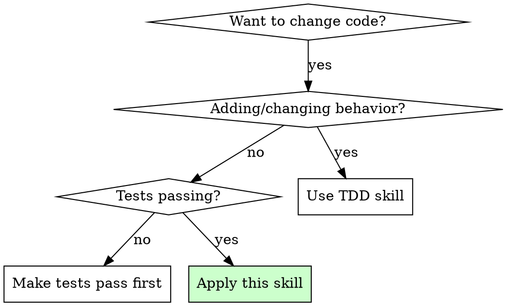

# Refactoring

## Overview

Refactoring improves code structure without changing behavior. Tests must pass before AND after.

**Core principle:** Behavior preservation is non-negotiable. If tests fail, you changed behavior.

**Violating the letter of this process is violating the spirit of refactoring.**

## The Iron Law

```
NO REFACTORING WITHOUT TESTS PASSING FIRST AND AFTER
```

Refactored with failing tests? You introduced bugs. Revert immediately.

**No exceptions:**
- "Tests don't cover this code" → Add tests first
- "I'll run tests after all changes" → One refactoring, verify, commit
- "IDE did it automatically" → Verify tests anyway

## When to Use



**Use for:** Code cleanup, technical debt, preparing for features
**Don't use for:** Bug fixes, new features (use TDD skill)

## The Safe Refactoring Loop

```
1. VERIFY GREEN     - Run tests, confirm all pass
2. IDENTIFY         - Pick ONE code smell (see Quick Reference table)
3. SELECT PATTERN   - Choose refactoring from refactoring-catalog.md
4. APPLY            - Make minimal structural change
5. VERIFY GREEN     - Run tests, confirm still pass
6. COMMIT           - One refactoring per commit
7. REPEAT or STOP
```

**REQUIRED SUB-SKILL:** Use superpowers:test-driven-development for test verification.

**Pattern Selection:** The `refactoring-catalog.md` file in this directory contains 24 patterns with before/after examples. Match your code smell to the pattern, review the example, then apply.

## Quick Reference

| Code Smell | Pattern | Action |
|------------|---------|--------|
| Long Method | Extract Method | Split into smaller functions |
| Duplicate Code | Extract + Reuse | Create shared helper |
| Feature Envy | Move Method | Move to correct class |
| Primitive Obsession | Replace with Object | Create value object |
| Large Class | Extract Class | Split responsibilities |
| Stateful Logic Duplication | Extract Custom Hook | Move to reusable hook (React) |
| Client-only Data Display | Convert to Server Component | Remove client JS (Next.js) |

See `refactoring-catalog.md` for complete pattern reference (29 patterns including React/Next.js).

## Example: Extract Method Walkthrough

**Scenario:** Long function with calculation buried in display logic.

**Step 1 - VERIFY GREEN:**
```bash
npm test
# ✅ 47 passing
```

**Step 2 - IDENTIFY:** Long method smell - `printReport()` is 35 lines with embedded price calculation.

**Step 3 - SELECT PATTERN:** Extract Method (from catalog).

**Step 4 - APPLY:**
```typescript
// Before: calculation embedded in printReport()
// After: extract to calculateOrderTotal()
function calculateOrderTotal(order: Order): number {
  return order.items.reduce((sum, item) =>
    sum + item.price * item.quantity, 0);
}
```

**Step 5 - VERIFY GREEN:**
```bash
npm test
# ✅ 47 passing (same count = no behavior change)
```

**Step 6 - COMMIT:**
```bash
git commit -m "refactor: extract calculateOrderTotal from printReport"
```

**Step 7 - REPEAT:** Next smell: magic number `0.08` for tax rate → Replace Magic Number with Constant.

## Commit Conventions

| Type | Pattern | Example |
|------|---------|---------|
| Extract | `refactor: extract X from Y` | `refactor: extract validateEmail from submitForm` |
| Rename | `refactor: rename X to Y` | `refactor: rename usr to user` |
| Move | `refactor: move X to Y` | `refactor: move parseDate to utils` |
| Inline | `refactor: inline X` | `refactor: inline tempVariable` |

## Common Rationalizations

| Excuse | Reality |
|--------|---------|
| "Just a quick cleanup" | Verify tests first. Always. |
| "Tests don't cover this" | Add tests before refactoring. |
| "IDE does this safely" | IDE refactorings can fail. Verify. |
| "I'll test after all changes" | One refactoring, verify, commit. |
| "Need to refactor to fix bug" | Bug fix = behavioral. Separate commits. |
| "The whole file needs cleanup" | One refactoring at a time. |

## Red Flags - STOP

- Tests not passing before starting
- Multiple refactorings before verify
- Mixing structural and behavioral changes
- "I'll run tests at the end"
- Refactoring without understanding code
- Fixing bugs while refactoring

**All of these mean: STOP. Revert. Start over.**

## When Stuck

| Situation | Action |
|-----------|--------|
| Tests fail after refactoring | Revert immediately. Re-read the pattern. Try smaller step. |
| Can't find matching pattern | Check `refactoring-catalog.md`. If truly novel, add tests first. |
| Refactoring reveals bug | STOP refactoring. Fix bug separately using **superpowers:systematic-debugging**. |
| Need to add feature mid-refactoring | STOP. Commit current refactoring. Switch to **superpowers:test-driven-development**. |
| Code has no tests | Add tests first using **superpowers:test-driven-development**, then refactor. |
| Unsure if change is behavioral | If in doubt, it's behavioral. Write a test that captures current behavior first. |

## Verification Checklist

**Before:**
- [ ] All tests pass (verified, not assumed)
- [ ] I understand what this code does
- [ ] I identified a specific code smell
- [ ] I selected a named refactoring pattern

**After:**
- [ ] All tests still pass
- [ ] Behavior unchanged (verified)
- [ ] One commit per refactoring
- [ ] Commit message follows convention

## Technical Debt Prioritization

**Severity:**
- **Critical:** Blocks development, causes bugs
- **High:** Slows development, increases risk
- **Medium:** Code smell, future concern
- **Low:** Cosmetic, nice to have

**Priority = (Velocity Impact x Bug Risk) / Effort**

**Example:** Scale 1-5 for each factor:

| Debt Item | Velocity | Bug Risk | Effort | Priority |
|-----------|----------|----------|--------|----------|
| God class in OrderService | 5 | 4 | 3 | (5×4)/3 = **6.7** ← Do first |
| Inconsistent naming | 2 | 1 | 1 | (2×1)/1 = **2.0** |
| Missing null checks | 3 | 5 | 2 | (3×5)/2 = **7.5** ← Highest priority |

Address Critical first, then High during feature work.
